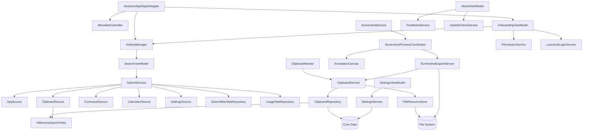

# Assistant MVP 内部接口设计详细方案

## 版本记录

| 版本 | 上线日期 | 说明 |
|------|---------|------|
| v1.0.0 | 2026-07-02 | 首次上线，Mac Super Assistant MVP（22 个用户故事） |

## 修订记录

| 日期 | 修改人 | 备注 |
| :--- | :--- | :--- |
| 2026-06-05 | Claude | 初始版本：SnapVault 内部接口设计 |
| 2026-06-11 | Claude | v2：按当前 Mac Super Assistant / Assistant MVP 架构重写内部接口设计 |

> 说明：本文件以 `doc/prd.md`、`doc/architecture.md`、`doc/architecture_db.md` 当前 Assistant MVP 决策为准。旧 SnapVault / GRDB / FTS5 / OCR / 文件搜索接口不再作为 MVP 实现依据。

---

## 1. 方案目标

本文定义 Assistant MVP 各模块之间的内部 Swift Protocol / Model 契约，目标是：

1. 明确搜索、剪贴板、截图、设置、权限、反馈、数据层的边界。
2. 支持 MVVM + Service + Provider + Repository 分层实现。
3. 支持单元测试和集成测试中的依赖注入。
4. 避免 UI 直接依赖 Core Data、文件系统或 macOS 底层 API。
5. 为后续 Action Panel、右键菜单、文件搜索、窗口控制、资源监控等能力预留扩展点；这些能力仅为后续扩展点，不进入 MVP 实现、测试验收或默认任务范围。

---

## 2. 通用约定

### 2.1 命名

- 产品暂定名：Mac Super Assistant。
- 工程内部代号：Assistant。
- 类型命名使用 Assistant 语义，不再使用 SnapVault。

### 2.2 并发

- UI / ViewModel：`@MainActor`。
- Service / Repository：优先使用 `async/await`。
- 事件流：使用 `AsyncStream` 或 Combine `Publisher`，实现阶段可二选一但同一模块内保持一致。
- Core Data 写入：后台 context。
- Core Data 读取：Repository 层封装，不直接暴露 `NSManagedObject` 给 UI。

### 2.3 错误模型

```swift
enum AssistantError: LocalizedError, Equatable {
    case permissionDenied(PermissionKind)
    case hotkeyConflict
    case clipboardUnavailable
    case recordNotFound(UUID)
    case resourceMissing(UUID)
    case fileWriteFailed(String)
    case fileReadFailed(String)
    case screenshotFailed(String)
    case commandRequiresConfirmation(CommandID)
    case commandExecutionFailed(CommandID, String)
    case invalidExpression
    case persistenceFailed(String)
    case unknown(String)
}
```

### 2.4 Result ID 稳定性

搜索结果 id 必须稳定，以支持黑名单和使用统计。

建议格式：

```text
app:<bundleID or pathHash>
command:<commandID>
setting:<settingsRoute>
clipboard:<recordUUID>
calculator:<normalizedExpressionHash>
```

---

## 3. Search 模块接口

### 3.1 SearchSource

```swift
protocol SearchSource {
    var id: SearchSourceID { get }
    var displayName: String { get }
    var isEnabledInSearch: Bool { get }

    func canSearch(query: String) -> Bool
    func search(query: String) async -> [SearchResult]
}

struct SearchSourceID: RawRepresentable, Hashable, Codable {
    let rawValue: String
}
```

MVP SearchSource：

```swift
extension SearchSourceID {
    static let app = SearchSourceID(rawValue: "app")
    static let clipboard = SearchSourceID(rawValue: "clipboard")
    static let command = SearchSourceID(rawValue: "command")
    static let calculator = SearchSourceID(rawValue: "calculator")
    static let settings = SearchSourceID(rawValue: "settings")
}
```

### 3.2 SearchResult

```swift
struct SearchResult: Identifiable, Hashable {
    let id: SearchResultID
    let sourceID: SearchSourceID
    let title: String
    let subtitle: String?
    let icon: SearchResultIcon
    let typeLabel: String
    let baseScore: Double
    let matchScore: Double
    let usageScore: Double
    let primaryAction: SearchAction
    let secondaryActions: [SearchAction]
}

struct SearchResultID: RawRepresentable, Hashable, Codable {
    let rawValue: String
}

enum SearchResultIcon: Hashable {
    case systemSymbol(String)
    case appIcon(URL)
    case thumbnail(UUID)
    case none
}
```

### 3.3 SearchAction

```swift
enum SearchAction: Hashable {
    case openApplication(ApplicationID)
    case copyClipboardRecord(UUID)
    case copyText(String)
    case runCommand(CommandID)
    case openSettings(SettingsRoute)
    case startScreenshot(ScreenshotMode)
}
```

MVP UI 只执行 `primaryAction`；`secondaryActions` 仅做模型预留。

### 3.4 SearchService

```swift
protocol SearchServiceProtocol {
    func search(query: String) async -> SearchResponse
    func execute(_ action: SearchAction) async throws
    func recordSelection(_ result: SearchResult) async
}

struct SearchResponse {
    let query: String
    let results: [SearchResult]
    let elapsed: TimeInterval
}
```

搜索规则：

- 空输入不返回结果。
- 所有来源合并排序后最多 12 条。
- 不分组。
- 黑名单过滤在排序前或排序后均可，但最终不得展示黑名单结果。

### 3.5 SearchScoring

```swift
protocol SearchScoringProtocol {
    func score(result: SearchResult, query: String) -> Double
}

struct SourcePriority {
    static let application: Double = 100
    static let command: Double = 90
    static let calculator: Double = 85
    static let settings: Double = 80
    static let clipboard: Double = 70
}
```

综合评分：

```text
finalScore = baseScore + matchScore + usageScore
```

---

## 4. AppSource 接口

```swift
protocol AppSourceProtocol: SearchSource {
    func rebuildIndex() async
    func refreshIndex() async
    func application(for id: ApplicationID) -> ApplicationIndexItem?
}

struct ApplicationID: RawRepresentable, Hashable, Codable {
    let rawValue: String
}

struct ApplicationIndexItem: Identifiable, Hashable {
    let id: ApplicationID
    let bundleIdentifier: String?
    let displayName: String
    let localizedName: String?
    let path: URL
    let pinyin: String?
    let initials: String?
    let launchCount: Int
    let lastLaunchAt: Date?
}
```

MVP 扫描范围：

- `/Applications`
- `~/Applications`
- `/System/Applications`

只索引 `.app` bundle。

---

## 5. Clipboard 模块接口

### 5.1 ClipboardMonitor

```swift
protocol ClipboardMonitorProtocol {
    var events: AsyncStream<ClipboardEvent> { get }

    func start()
    func stop()
    func pollNow() async
}

struct ClipboardEvent: Hashable {
    let payload: ClipboardPayload
    let contentHash: String
    let capturedAt: Date
}
```

轮询策略：

- 默认/活跃 500ms。
- 长时间无变化 2s。
- 检测到变化恢复 500ms。

### 5.2 ClipboardPayload

```swift
enum ClipboardPayload: Hashable {
    case plainText(String)
    case richText(plainText: String, rtfData: Data?, htmlData: Data?)
    case image(data: Data)
    case files([FileClipboardItem])
}

struct FileClipboardItem: Hashable, Codable {
    let path: URL
    let displayName: String
    let uti: String?
    let fileSize: Int64?
}
```

### 5.3 ClipboardService

```swift
protocol ClipboardServiceProtocol {
    func handle(event: ClipboardEvent) async throws -> ClipboardRecordSnapshot
    func copyRecordToPasteboard(id: UUID) async throws
    func pauseRecording()
    func resumeRecording()
    var isRecordingEnabled: Bool { get }
}
```

规则：

- 默认启用记录。
- 复制历史项回系统剪贴板，不自动粘贴到前台 App。
- 富文本恢复失败时降级纯文本。
- 图片恢复使用原图。
- 文件恢复写回文件 URL 引用。

### 5.4 ClipboardRepository

```swift
protocol ClipboardRepositoryProtocol {
    func upsert(event: ClipboardEvent, resources: [ClipboardResourceDraft]) async throws -> ClipboardRecordSnapshot
    func fetch(id: UUID) async throws -> ClipboardRecordSnapshot?
    func fetchHistory(filter: ClipboardHistoryFilter) async throws -> [ClipboardRecordSnapshot]
    func delete(id: UUID) async throws
    func clearAll() async throws
    func togglePin(id: UUID) async throws -> ClipboardRecordSnapshot
    func cleanupExpired(now: Date) async throws -> Int
    func storageUsage() async throws -> StorageUsage
}

struct ClipboardHistoryFilter: Hashable {
    var query: String?
    var contentType: ClipboardContentType?
    var includePinned: Bool = true
}
```

### 5.5 ClipboardRecordSnapshot

Repository 不向 UI 暴露 `NSManagedObject`，而是暴露 snapshot。

```swift
struct ClipboardRecordSnapshot: Identifiable, Hashable {
    let id: UUID
    let contentType: ClipboardContentType
    let plainText: String?
    let summary: String?
    let contentHash: String
    let isPinned: Bool
    let createdAt: Date
    let updatedAt: Date
    let filePath: URL?
    let fileDisplayName: String?
    let resources: [ClipboardResourceSnapshot]
}

enum ClipboardContentType: String, Codable, CaseIterable {
    case text
    case richText
    case image
    case file
}

struct ClipboardResourceSnapshot: Identifiable, Hashable {
    let id: UUID
    let type: ClipboardResourceType
    let relativePath: String
    let mimeType: String?
    let byteSize: Int64
    let width: Int?
    let height: Int?
}

enum ClipboardResourceType: String, Codable {
    case imageOriginal
    case imageThumbnail
    case richTextRTF
    case richTextHTML
}
```

---

## 6. FileResourceStore 接口

```swift
protocol FileResourceStoreProtocol {
    func writeImageOriginal(_ data: Data, id: UUID) async throws -> FileResourceWriteResult
    func writeThumbnail(_ data: Data, id: UUID) async throws -> FileResourceWriteResult
    func writeRichTextRTF(_ data: Data, id: UUID) async throws -> FileResourceWriteResult
    func writeRichTextHTML(_ data: Data, id: UUID) async throws -> FileResourceWriteResult
    func read(relativePath: String) async throws -> Data
    func delete(relativePath: String) async
    func exists(relativePath: String) -> Bool
    func storageUsage() async throws -> Int64
}

struct FileResourceWriteResult: Hashable {
    let id: UUID
    let relativePath: String
    let byteSize: Int64
    let mimeType: String?
}
```

MVP 目录：

```text
Clipboard/Images/
Clipboard/Thumbnails/
Clipboard/RichText/
```

文件名使用 UUID，Core Data 保存相对路径或资源标识。

---

## 7. InMemorySearchIndex 接口

```swift
protocol InMemorySearchIndexProtocol {
    func rebuild(from records: [SearchIndexItem])
    func upsert(_ item: SearchIndexItem)
    func remove(id: UUID)
    func removeAll(sourceID: SearchSourceID)
    func searchClipboard(query: String, filter: ClipboardContentType?) -> [SearchIndexItem]
}

struct SearchIndexItem: Identifiable, Hashable {
    let id: UUID
    let sourceID: SearchSourceID
    let recordID: UUID?
    let title: String
    let plainText: String?
    let summary: String?
    let contentType: ClipboardContentType?
    let pinyin: String?
    let initials: String?
    let updatedAt: Date
    let isPinned: Bool
    let contentHash: String?
    let resourceReferences: [UUID]
    let usageCount: Int
    let lastUsedAt: Date?
}
```

启动时全量加载轻量字段，不加载图片原图、RTF/HTML 原始数据等大对象。

---

## 8. ClipboardSource 接口

```swift
protocol ClipboardSourceProtocol: SearchSource {
    func searchClipboard(query: String) async -> [SearchResult]
}
```

触发规则：

- 输入不少于 2 个字符才搜索。
- 剪贴板正文不做拼音索引，只做原文搜索。
- 主动作：复制记录到系统剪贴板。

---

## 9. Screenshot 模块接口

### 9.1 ScreenshotService

```swift
protocol ScreenshotServiceProtocol {
    func startCapture(mode: ScreenshotMode) async throws
    func cancelCurrentCapture()
}

enum ScreenshotMode: String, Codable, Hashable {
    case region
    case fullScreen
    case window
}

struct ScreenshotCaptureResult: Hashable {
    let imageData: Data
    let mode: ScreenshotMode
    let size: CGSize
    let capturedAt: Date
}
```

### 9.2 ScreenshotPreview

```swift
protocol ScreenshotPreviewCoordinatorProtocol: AnyObject {
    func present(result: ScreenshotCaptureResult)
    func dismiss(discard: Bool)
}
```

工具栏动作：

```swift
enum ScreenshotToolbarAction: Hashable {
    case copy
    case save
    case annotate
    case cancel
}
```

### 9.3 Annotation Model

```swift
enum AnnotationTool: String, Codable, CaseIterable {
    case rectangle
    case arrow
    case text
    case mosaic
}

struct AnnotationStyle: Hashable, Codable {
    let color: AnnotationColor
    let lineWidth: AnnotationLineWidth
    let textSize: AnnotationTextSize
}

enum AnnotationColor: String, Codable, CaseIterable {
    case red, yellow, blue, green, white, black
}

enum AnnotationLineWidth: String, Codable, CaseIterable {
    case thin, medium, thick
}

enum AnnotationTextSize: String, Codable, CaseIterable {
    case small, medium, large
}

struct AnnotationShape: Identifiable, Hashable, Codable {
    let id: UUID
    let tool: AnnotationTool
    let startPoint: CGPoint
    let endPoint: CGPoint?
    let text: String?
    let style: AnnotationStyle
}
```

### 9.4 ScreenshotExportService

```swift
protocol ScreenshotExportServiceProtocol {
    func render(imageData: Data, annotations: [AnnotationShape]) async throws -> Data
    func copyPNGToPasteboard(_ pngData: Data) async throws
    func savePNG(_ pngData: Data, directory: URL) async throws -> URL
}
```

规则：

- 保存格式只支持 PNG。
- 默认目录 `~/Pictures/Screenshots`。
- 文件名 `Screenshot yyyy-MM-dd HH.mm.ss.png`。
- 复制后进入剪贴板历史。
- 保存后不写入剪贴板历史。

---

## 10. Command 模块接口

```swift
protocol CommandSourceProtocol: SearchSource {
    var commands: [SystemCommand] { get }
}

protocol CommandExecutorProtocol {
    func execute(_ commandID: CommandID) async throws
    func requiresConfirmation(_ commandID: CommandID) -> Bool
}

struct CommandID: RawRepresentable, Hashable, Codable {
    let rawValue: String
}

struct SystemCommand: Identifiable, Hashable {
    let id: CommandID
    let title: String
    let localizedTitleKey: String
    let aliases: [String]
    let pinyin: String?
    let initials: String?
    let iconSystemName: String
    let requiresConfirmation: Bool
}
```

### 10.1 MVP 内置命令权威清单

| CommandID | 中文名 | English | 风险分类 | 是否确认 | 执行动作 | 测试用例 |
| :--- | :--- | :--- | :--- | :--- | :--- | :--- |
| `openSystemSettings` | 打开系统设置 | Open System Settings | 低风险 | 否 | 打开 macOS System Settings | CMD-001 |
| `openAppSettings` | 打开本应用设置 | Open App Settings | 低风险 | 否 | 打开管理中心设置页 | CMD-002 |
| `openDownloads` | 打开下载目录 | Open Downloads | 低风险 | 否 | Finder 打开 Downloads | CMD-003 |
| `openApplications` | 打开应用程序目录 | Open Applications | 低风险 | 否 | Finder 打开 /Applications | CMD-003 |
| `openDesktop` | 打开桌面目录 | Open Desktop | 低风险 | 否 | Finder 打开 Desktop | CMD-003 |
| `captureRegion` | 区域截图 | Capture Region | 低风险 | 否 | 进入区域截图 | CMD-004 |
| `captureFullScreen` | 全屏截图 | Capture Full Screen | 低风险 | 否 | 进入全屏截图 | CMD-004 |
| `captureWindow` | 窗口截图 | Capture Window | 低风险 | 否 | 进入窗口截图 | CMD-004 |
| `clearClipboardHistory` | 清空剪贴板历史 | Clear Clipboard History | 中风险白名单 | 是 | 二次确认后清空剪贴板历史 | CMD-005 |
| `toggleClipboardRecording` | 暂停/恢复剪贴板记录 | Pause/Resume Clipboard Recording | 低风险 | 否 | 切换剪贴板记录状态 | CMD-006 |
| `checkPermissions` | 检查权限状态 | Check Permissions | 低风险 | 否 | 打开权限页或显示权限状态 | CMD-007 |
| `restartFinder` | 重启 Finder | Restart Finder | 中风险白名单 | 是 | 二次确认后重启 Finder | CMD-008 |
| `restartDock` | 重启 Dock | Restart Dock | 中风险白名单 | 是 | 二次确认后重启 Dock | CMD-008 |
| `toggleAppearance` | 切换深色/浅色模式 | Toggle Appearance | 低风险 | 否 | 切换系统深浅色外观 | CMD-009 |

### 10.2 命令风险边界

允许但需确认的中风险白名单系统操作：

- 清空剪贴板历史。
- 重启 Finder。
- 重启 Dock。

禁止的高风险命令：

- 任意 shell。
- sudo。
- 关机。
- 重启系统。
- 注销。
- 删除文件。
- 杀进程。

---

## 11. CalculatorSource 接口

```swift
protocol CalculatorSourceProtocol: SearchSource {
    func parse(_ query: String) -> CalculationRequest?
    func evaluate(_ request: CalculationRequest) throws -> CalculationResult
}

enum CalculationRequest: Hashable {
    case expression(String)
    case unitConversion(value: Double, sourceUnit: String, targetUnit: String?)
}

struct CalculationResult: Hashable {
    let displayText: String
    let copyText: String
}
```

MVP 支持：

- 四则运算、括号、小数。
- 长度、重量、数据大小、温度。
- 计算与换算结果通过 `SearchAction.copyText` 复制到系统剪贴板；默认 `SearchService` 执行器负责写入 `NSPasteboard.general`，剪贴板历史仍由统一监听与去重链路处理。

安全与范围约束：

- 表达式求值必须使用白名单解析器（例如递归下降 parser），只接受数字、小数点、空白、`+ - * / ( )`。
- 不使用 `NSExpression` 或任意可执行表达式/函数机制处理用户输入。
- 非法表达式、除零、NaN/Infinity 必须静默返回空结果，不污染搜索。
- 单位换算要求明确源单位和目标单位，例如 `10 cm to inch`。
- 不支持货币、复杂函数、变量、计算历史，也不支持体积/时长等 MVP 范围外单位。

---

## 12. Settings 模块接口

### 12.1 SettingsService

```swift
protocol SettingsServiceProtocol {
    func value<T: Decodable>(for key: SettingKey, as type: T.Type) async throws -> T
    func set<T: Encodable>(_ value: T, for key: SettingKey) async throws
    func reset(key: SettingKey) async throws
}

enum SettingKey: String, CaseIterable, Codable {
    case onboardingCompleted = "onboarding.completed"
    case searchHotkey = "hotkey.search"
    case launchAtLoginEnabled = "launchAtLogin.enabled"
    case clipboardEnabled = "clipboard.enabled"
    case clipboardShowInSearch = "clipboard.showInSearch"
    case clipboardRetention = "clipboard.retention"
    case appSourceEnabled = "search.source.app.enabled"
    case commandSourceEnabled = "search.source.command.enabled"
    case calculatorSourceEnabled = "search.source.calculator.enabled"
    case settingsSourceEnabled = "search.source.settings.enabled"
    case screenshotSaveDirectory = "screenshot.saveDirectory"
    case languageMode = "language.mode"
}
```

### 12.2 SettingsSource

```swift
protocol SettingsSourceProtocol: SearchSource {
    var routes: [SettingsSearchRoute] { get }
}

struct SettingsSearchRoute: Identifiable, Hashable {
    let id: SettingsRoute
    let title: String
    let aliases: [String]
    let pinyin: String?
    let initials: String?
}

enum SettingsRoute: String, Codable, Hashable {
    case settings
    case permissions
    case clipboardHistory
    case searchSources
    case hotkey
    case screenshot
    case about
}
```

MVP 不支持从搜索结果直接切换设置开关。

---

## 13. Permission 接口

```swift
protocol PermissionServiceProtocol {
    func status(for permission: PermissionKind) -> PermissionStatus
    func openSystemSettings(for permission: PermissionKind)
    func refreshStatuses() async -> [PermissionKind: PermissionStatus]
}

enum PermissionKind: String, Codable, CaseIterable {
    case screenRecording
    case accessibility
}

enum PermissionStatus: String, Codable {
    case authorized
    case denied
    case notDetermined
    case unknown
}
```

Onboarding 必须强制完成 screenRecording 和 accessibility。

---

## 14. Hotkey 与 LaunchAtLogin 接口

```swift
/// 默认搜索快捷键为 ⌥ Space（Option + Space），配置持久化键为 `hotkey.search`。
protocol HotkeyManagerProtocol {
    func register(_ hotkey: HotkeyDefinition) throws
    func unregister()
    func validate(_ hotkey: HotkeyDefinition) -> HotkeyValidationResult
    var events: AsyncStream<HotkeyEvent> { get }
}

struct HotkeyDefinition: Hashable, Codable {
    let keyCode: UInt32
    let modifiers: HotkeyModifiers
}

struct HotkeyModifiers: OptionSet, Hashable, Codable {
    let rawValue: Int
}

enum HotkeyValidationResult: Hashable {
    case valid
    case conflict
    case invalid
}

enum HotkeyEvent: Hashable {
    case searchToggle
}

protocol LaunchAtLoginServiceProtocol {
    func isEnabled() -> Bool
    func setEnabled(_ enabled: Bool) throws
}
```

---

## 15. Feedback / Update / About 接口

```swift
protocol FeedbackServiceProtocol {
    func makeFeedbackEmail(context: FeedbackContext) throws -> URL
}

struct FeedbackContext: Hashable {
    let appVersion: String
    let buildNumber: String
    let macOSVersion: String
    let errorSummary: String?
}

protocol UpdateCheckServiceProtocol {
    func openDownloadPage()
}

protocol AboutInfoProviderProtocol {
    var appName: String { get }
    var version: String { get }
    var buildNumber: String { get }
    var homepageURL: URL { get }
    var privacyPolicyURL: URL { get }
    var thirdPartyLicensesURL: URL? { get }
}
```

MVP 检查更新只打开官网/下载页或 GitHub Release，不做自动下载安装。

---

## 16. ViewModel 接口

### 16.1 SearchViewModel

```swift
@MainActor
final class SearchViewModel: ObservableObject {
    @Published var query: String = ""
    @Published var results: [SearchResult] = []
    @Published var selectedIndex: Int = 0
    @Published var isVisible: Bool = false

    func open()
    func close()
    func toggle()
    func search() async
    func moveUp()
    func moveDown()
    func confirmSelection() async
}
```

### 16.2 ClipboardHistoryViewModel

```swift
@MainActor
final class ClipboardHistoryViewModel: ObservableObject {
    @Published var query: String = ""
    @Published var filter: ClipboardContentType?
    @Published var items: [ClipboardRecordSnapshot] = []
    @Published var selectedIndex: Int = 0
    @Published var storageUsage: StorageUsage?

    func load() async
    func search() async
    func selectNext()
    func selectPrevious()
    func copySelectedToPasteboard() async
    func togglePin(_ id: UUID) async
    func delete(_ id: UUID) async
    func clearAll() async
}
```

### 16.3 OnboardingViewModel

```swift
@MainActor
final class OnboardingViewModel: ObservableObject {
    @Published var step: OnboardingStep = .welcome
    @Published var permissionStatuses: [PermissionKind: PermissionStatus] = [:]
    @Published var hotkeyValidation: HotkeyValidationResult = .valid

    func continueToNextStep()
    func validateHotkey(_ hotkey: HotkeyDefinition)
    func openPermissionSettings(_ kind: PermissionKind)
    func refreshPermissions() async
    func completeIfPossible() async throws
}

enum OnboardingStep: String, CaseIterable {
    case welcome
    case searchHotkey
    case clipboardPrivacy
    case screenRecording
    case accessibility
    case launchAtLogin
    case done
}
```

### 16.4 SettingsViewModel

```swift
@MainActor
final class SettingsViewModel: ObservableObject {
    @Published var searchHotkey: HotkeyDefinition
    @Published var launchAtLoginEnabled: Bool
    @Published var clipboardEnabled: Bool
    @Published var clipboardShowInSearch: Bool
    @Published var retention: ClipboardRetention
    @Published var screenshotSaveDirectory: URL
    @Published var languageMode: LanguageMode
    @Published var blacklistItems: [SearchBlacklistItemSnapshot]

    func save() async
    func removeBlacklistItem(_ id: UUID) async
}

enum ClipboardRetention: String, Codable, CaseIterable {
    case sevenDays = "7d"
    case thirtyDays = "30d"
    case ninetyDays = "90d"
    case forever = "forever"
}

enum LanguageMode: String, Codable, CaseIterable {
    case system
    case simplifiedChinese
    case english
}
```

---

## 17. 依赖关系图



---

## 18. 测试接口要求

为了支持 `doc/test.md` 中的测试策略，实现时应满足：

- `ClipboardMonitorProtocol` 可替换为 mock pasteboard monitor。
- `FileResourceStoreProtocol` 可使用临时目录实现。
- `ClipboardRepositoryProtocol` 可使用临时 Core Data store。
- `SearchSource` 可独立测试。
- `SearchService` 可注入 mock sources、mock blacklist、mock usage stats。
- `ScreenshotExportServiceProtocol` 的 render 逻辑可用固定图片和 annotation model 测试。
- `PermissionServiceProtocol`、`HotkeyManagerProtocol`、`LaunchAtLoginServiceProtocol` 可 mock。

---

## 19. 变更记录

| 日期 | 变更内容 |
| :--- | :--- |
| 2026-06-11 | v2：重写 Assistant MVP 内部接口设计。定义 SearchSource/SearchService/SearchResult/SearchAction、ClipboardMonitor/ClipboardService/ClipboardRepository、FileResourceStore、InMemorySearchIndex、Screenshot/Annotation、Command、Calculator、Settings、Permission、Hotkey、Feedback/Update/About 以及 ViewModel 接口。 |
