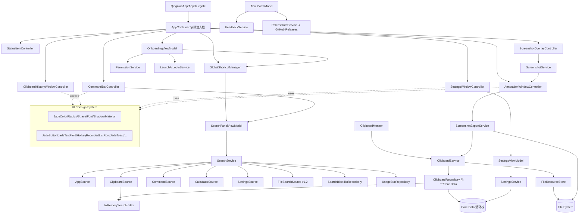

# 青鸟 Qingniao 内部接口设计详细方案

> 版本：**v3** · 关联：`doc/architecture/design.md`（v17）、`doc/architecture/db.md`（v3）、`doc/prd.md`（青鸟 v1.2）

## 版本记录

| 版本 | 上线日期 | 说明 |
|------|---------|------|
| v1.0.0 | 2026-07-02 | 首次上线，MVP（22 个用户故事） |
| v1.1.0 | 2026-07-03 | Onboarding 修复相关接口（`requestScreenRecordingPrompt()`、`skipOnboarding()`） |
| v1.2.0 | 2026-07-03 | 品牌改名 Qingniao；DesignTokens/统一组件；FileSearchSource/FileSearchResult；AppContainer + 窗口控制器；按需辅助功能；全屏截图热键；HotkeyConflictDetector；QingniaoError；删除 UnifiedSearch*/UnitConverterSource/OCR/GRDB 双路径接口 |

## 修订记录

| 日期 | 修改人 | 备注 |
| :--- | :--- | :--- |
| 2026-06-05 → 2026-06-11 | Claude | v1–v2：SnapVault → Assistant MVP 内部接口设计 |
| 2026-07-03 | arch subagent | **v3：品牌前缀由 Assistant 改为 Qingniao（module 名 Qingniao、测试模块 QingniaoTests）；`AssistantError`→`QingniaoError` 并新增 case；新增 DesignTokens/JadeButton/JadeTextField/JadeToast、FileSearchSource/FileSearchResult、AppContainer、CommandBarController/ClipboardHistoryWindowController/SettingsWindowController/AnnotationWindowController/ScreenshotOverlayController/StatusItemController、GlobalShortcutManager.registerFullscreenCapture()、HotkeyConflictDetector、PermissionService.onDemandAccessibilityCheck()、OnboardingViewModel 单屏化；列出 Deprecated/Removed in v1.2；依赖图更新。** |

> 本文件定义青鸟 Qingniao 各模块间的 Swift Protocol / Model 契约（讲契约，不讲具体实现行），以 `doc/prd.md` 与 `doc/architecture/design.md` 当前决策为准。

---

## 1. 方案目标

1. 明确搜索、剪贴板、截图、设置、权限、反馈、数据、UI 设计系统各层边界。
2. 支持 MVVM + Service + Provider + Repository 分层与 **AppContainer 依赖注入**。
3. 支持单元/集成测试的依赖注入。
4. 避免 UI 直接依赖 Core Data、文件系统或 macOS 底层 API。
5. 为后续 Action Panel、右键菜单、窗口控制、资源监控预留扩展点（不进入 MVP 实现）。

---

## 2. 通用约定

### 2.1 命名（v1.2 品牌决策）

- 中文名青鸟、英文名 Qingniao；Bundle ID 保留 `com.assistant.app`。
- **Swift module 名改为 `Qingniao`，测试模块 `QingniaoTests`**。
- 公开类型前缀由 `Assistant` 改为 `Qingniao`；无品牌前缀的领域类型名保持不变。

**类型改名清单（v1.2）：**

| 旧 | 新 | 说明 |
| :--- | :--- | :--- |
| `AssistantError` | `QingniaoError` | 统一错误模型（并新增 case，见 §2.3） |
| `AssistantClipboardRepository` | `ClipboardRepository`（Qingniao 模块下，Core Data 实现，唯一仓库） | 原 GRDB 版 `ClipboardRepository` 已删除，名字回收给活动仓库 |
| module `SnapVault`/`Assistant` | module `Qingniao` | 工程/target/module |
| `AssistantClipboardSource` | `ClipboardSource`（Qingniao 模块下） | 保持协议契约 |
| `ClipboardRecord` / `ClipboardRecordSnapshot` | 保持 | 领域模型名不带品牌前缀，不改 |
| `SearchResult` / `SearchAction` / `SearchSource` | 保持 | 领域契约名不改 |

> 命名总原则：品牌前缀类型改 `Qingniao`；`Clipboard*` / `Search*` / `Screenshot*` / `Annotation*` 等领域名保持稳定，避免大范围无谓改名扩大回归面。

### 2.2 并发

- UI / ViewModel：`@MainActor`。
- Service / Repository：`async/await`。
- 事件流：`AsyncStream` 或 Combine（同模块内一致）。
- Core Data 写后台 context；读经 Repository 封装，不暴露 `NSManagedObject`。

### 2.3 错误模型（QingniaoError）

```swift
enum QingniaoError: LocalizedError, Equatable {
    case permissionDenied(PermissionKind)
    case hotkeyConflict                    // 见新增 HotkeyConflictDetector
    case clipboardUnavailable
    case recordNotFound(UUID)
    case resourceMissing(UUID)
    case fileWriteFailed(String)
    case fileReadFailed(String)
    case screenshotFailed(String)
    case commandRequiresConfirmation(CommandID)
    case commandExecutionFailed(CommandID, String)
    case invalidExpression
    case persistenceFailed(String)
    // v1.2 新增：
    case fileSearchIndexFailed(String)     // 文件搜索索引/查询失败
    case hotkeyConflictDetected(String)    // 具体冲突热键描述（注册返回失败）
    case sandboxIncompatible               // 保留占位：Sandbox 已关闭，正常不触发
    case dataResetFailed(String)           // 清空所有数据失败
    case unknown(String)
}
```

> `sandboxIncompatible` 在 v1.2 关闭 Sandbox 后正常不触发，作为占位保留以标识历史沙盒相关失败语义。

### 2.4 Result ID 稳定性

```text
app:<bundleID or pathHash>
command:<commandID>
setting:<settingsRoute>
clipboard:<recordUUID>
calculator:<normalizedExpressionHash>
file:<pathHash>          // v1.2 新增，FileSearchResult 稳定 id
```

---

## 3. Search 模块接口

### 3.1 SearchSource

```swift
protocol SearchSource {
    var id: SearchSourceID { get }
    var displayName: String { get }
    var isEnabledInSearch: Bool { get }
    func canSearch(query: String) -> Bool
    func search(query: String) async -> [SearchResult]
}

struct SearchSourceID: RawRepresentable, Hashable, Codable { let rawValue: String }

extension SearchSourceID {
    static let app = SearchSourceID(rawValue: "app")
    static let clipboard = SearchSourceID(rawValue: "clipboard")
    static let command = SearchSourceID(rawValue: "command")
    static let calculator = SearchSourceID(rawValue: "calculator")
    static let settings = SearchSourceID(rawValue: "settings")
    static let file = SearchSourceID(rawValue: "file")     // v1.2 新增
}
```

### 3.2 SearchResult / FileSearchResult

```swift
struct SearchResult: Identifiable, Hashable {
    let id: SearchResultID
    let sourceID: SearchSourceID
    let title: String
    let subtitle: String?
    let icon: SearchResultIcon
    let typeLabel: String
    let baseScore: Double
    let matchScore: Double
    let usageScore: Double
    let primaryAction: SearchAction
    let secondaryActions: [SearchAction]
}

enum SearchResultIcon: Hashable {
    case systemSymbol(String)
    case appIcon(URL)
    case thumbnail(UUID)
    case fileIcon(URL)          // v1.2 新增：按 UTI 取系统文件图标
    case none
}

/// v1.2 新增：文件搜索结果，承载路径/大小/时间等文件元信息。
/// 通过 toSearchResult() 归一为 SearchResult 进入统一排序，或作为 SearchResult 的携带载荷。
struct FileSearchResult: Identifiable, Hashable {
    let id: SearchResultID          // "file:<pathHash>"
    let url: URL
    let displayName: String
    let relativePathLabel: String   // 展示用路径（相对主目录）
    let byteSize: Int64?
    let modifiedAt: Date?
    let uti: String?
    // 主动作 openFile(url)，次级 revealInFinder(url)
}
```

### 3.3 SearchAction

```swift
enum SearchAction: Hashable {
    case openApplication(ApplicationID)
    case copyClipboardRecord(UUID)
    case copyText(String)
    case runCommand(CommandID)
    case openSettings(SettingsRoute)
    case startScreenshot(ScreenshotMode)
    // v1.2 新增（文件搜索）：
    case openFile(URL)
    case revealInFinder(URL)
}
```

### 3.4 SearchService

```swift
protocol SearchServiceProtocol {
    func search(query: String) async -> SearchResponse
    func execute(_ action: SearchAction) async throws
    func recordSelection(_ result: SearchResult) async
    func recentAndFavorites() async -> [SearchResult]   // v1.2 新增：空态首页
}

struct SearchResponse {
    let query: String
    let results: [SearchResult]
    let elapsed: TimeInterval
}
```

- 空输入返回 `recentAndFavorites()`（最近使用 + 收藏，D-120），非旧"完全空"。
- 合并排序后最多 12 条，不分组，黑名单最终不展示。

### 3.5 SearchScoring

```swift
struct SourcePriority {
    static let application: Double = 100
    static let command: Double = 90
    static let calculator: Double = 85
    static let settings: Double = 80
    static let file: Double = 75        // v1.2 新增（按 design §7.4 / PRD §9.3）
    static let clipboard: Double = 70
}
```

`finalScore = baseScore + matchScore + usageScore`。

---

## 4. AppSource 接口

沿用 v2（`AppSourceProtocol`、`ApplicationIndexItem`，扫描 `/Applications`、`~/Applications`、`/System/Applications`）。不变更。

---

## 5. FileSearchSource 接口（v1.2 新增）

```swift
protocol FileSearchSourceProtocol: SearchSource {
    /// 默认索引根目录：~/Desktop、~/Documents、~/Downloads
    var indexedRoots: [URL] { get }
    func searchFiles(query: String) async -> [FileSearchResult]
}
```

契约要点（对应 design §9 / PRD FR-SEARCH-FILE）：

- 由 `AppContainer` 实例化并注册到 `SearchService`（修复此前从未实例化的缺口）。
- 触发 ≥ 2 字符；异步执行，不阻塞其他来源。
- 默认排除隐藏文件/目录、`~/Library`、系统缓存、`.app` 内部内容。
- 只做文件名/路径匹配，不做内容全文检索。
- 检索优先 Spotlight metadata（`NSMetadataQuery`/`MDQuery`），降级 `FileManager` enumerator。
- 主动作 `openFile(url)`，次级动作 `revealInFinder(url)`。
- 失败抛 `QingniaoError.fileSearchIndexFailed`。

---

## 6. Clipboard 模块接口

`ClipboardMonitorProtocol` / `ClipboardPayload` / `ClipboardServiceProtocol` / `ClipboardRecordSnapshot` / `ClipboardContentType` / `ClipboardResourceSnapshot` 沿用 v2 契约（文本/富文本/图片/文件；自适应轮询；复制回不自动粘贴；富文本降级纯文本）。

**唯一仓库**（v1.2）：

```swift
/// Core Data 实现的唯一活动仓库（原 AssistantClipboardRepository 在 Qingniao 模块下即 ClipboardRepository）。
protocol ClipboardRepositoryProtocol {
    func upsert(event: ClipboardEvent, resources: [ClipboardResourceDraft]) async throws -> ClipboardRecordSnapshot
    func fetch(id: UUID) async throws -> ClipboardRecordSnapshot?
    func fetchHistory(filter: ClipboardHistoryFilter) async throws -> [ClipboardRecordSnapshot]
    func delete(id: UUID) async throws
    func clearAll() async throws
    func togglePin(id: UUID) async throws -> ClipboardRecordSnapshot
    func cleanupExpired(now: Date) async throws -> Int
    func storageUsage() async throws -> StorageUsage
}
```

> GRDB 版 `ClipboardRepository` 与 `ContentRepository` 已在 v1.2 删除（见 §末 Removed 表）。`ClipboardRecordSnapshot` 不再含 `ocrText`（见 db.md）。

---

## 7. FileResourceStore / 8. InMemorySearchIndex

沿用 v2 契约（大对象目录 `Clipboard/Images|Thumbnails|RichText`、UUID 命名；内存索引启动全量加载轻量字段）。不变更。

---

## 9. Screenshot 模块接口

`ScreenshotServiceProtocol`、`ScreenshotMode`（region/fullScreen/window）、`ScreenshotCaptureResult`、`ScreenshotPreviewCoordinatorProtocol`、`ScreenshotToolbarAction`、`AnnotationTool`（rectangle/arrow/text/mosaic）、`AnnotationStyle/Color/LineWidth/TextSize`、`AnnotationShape`、`ScreenshotExportServiceProtocol` 沿用 v2。

v1.2 变更：

- `AnnotationTool` **不含 blur**（v1.3）；mosaic 保留（`CIPixellate` scale 10）。
- 预览/工具栏改悬浮 pill（`.ultraThinMaterial`），由 `AnnotationWindowController` 承载（见 §19 窗口控制器）。
- 保存默认到上次目录（`~/Desktop`），`⌥`+保存弹 `NSSavePanel`。

---

## 10. Command 模块接口

`CommandSourceProtocol` / `CommandExecutorProtocol` / `SystemCommand` / 14 条内置命令权威清单沿用 v2（含 `captureFullScreen`）。执行走 NSWorkspace/AppleScript，Sandbox 关闭后 AppleEvents 畅通。不引入 shell。

---

## 11. CalculatorSource 接口

沿用 v2（`CalculatorSourceProtocol`、`CalculationRequest`(expression/unitConversion)、`CalculationResult`）。

v1.2 变更：

- **单位换算统一由 CalculatorSource 承载**（独立 `UnitConverterSource` 已删除）。长度/重量/数据大小/温度。
- 内部正则改预编译常量（消除 `try! NSRegularExpression` 强制解包）。

---

## 12. Settings 模块接口

### 12.1 SettingsService

```swift
protocol SettingsServiceProtocol {
    func value<T: Decodable>(for key: SettingKey, as type: T.Type) async throws -> T
    func set<T: Encodable>(_ value: T, for key: SettingKey) async throws
    func reset(key: SettingKey) async throws
}

enum SettingKey: String, CaseIterable, Codable {
    case onboardingCompletedAt = "onboarding.completedAt"   // v1.2 改：Date? 判定首次启动（取代 onboarding.completed）
    case searchHotkey = "hotkey.search"
    case fullscreenCaptureHotkey = "hotkey.capture.fullscreen"  // v1.2 新增
    case regionCaptureHotkey = "hotkey.capture.region"
    case windowCaptureHotkey = "hotkey.capture.window"
    case launchAtLoginEnabled = "launchAtLogin.enabled"
    case clipboardEnabled = "clipboard.enabled"
    case clipboardShowInSearch = "clipboard.showInSearch"
    case clipboardRetention = "clipboard.retention"
    case appSourceEnabled = "search.source.app.enabled"
    case commandSourceEnabled = "search.source.command.enabled"
    case calculatorSourceEnabled = "search.source.calculator.enabled"
    case settingsSourceEnabled = "search.source.settings.enabled"
    case fileSourceEnabled = "search.source.file.enabled"   // v1.2 新增
    case screenshotSaveDirectory = "screenshot.saveDirectory"
    case appearanceMode = "appearance.mode"                 // v1.2 新增 system/light/dark
    case dataFolderBookmark = "data.folderBookmark"         // v1.2 新增 安全书签
    case languageMode = "language.mode"
}
```

### 12.2 SettingsSource

`SettingsSourceProtocol` / `SettingsSearchRoute` 沿用；`SettingsRoute` 扩展 v1.2 新页：

```swift
enum SettingsRoute: String, Codable, Hashable {
    case overview        // 概览
    case clipboardHistory
    case hotkey
    case screenshot
    case searchSources
    case appearance      // v1.2 新增
    case permissions
    case data            // v1.2 新增（清空/导出占位/打开目录）
    case updates
    case about
    case feedback        // v1.2 新增
}
```

---

## 13. Permission 接口

```swift
protocol PermissionServiceProtocol {
    func status(for permission: PermissionKind) -> PermissionStatus
    func openSystemSettings(for permission: PermissionKind)
    func refreshStatuses() async -> [PermissionKind: PermissionStatus]
    @MainActor func requestScreenRecordingPrompt() -> Bool        // v1.1 已交付
    @MainActor func onDemandAccessibilityCheck() -> Bool          // v1.2 新增：按需检查辅助功能，未授予时弹说明 Alert 并可打开系统设置
}

enum PermissionKind: String, Codable, CaseIterable { case screenRecording, accessibility }
enum PermissionStatus: String, Codable { case authorized, denied, notDetermined, unknown }
```

- 屏幕录制在 Onboarding 强制；**辅助功能改为按需**（首次触发相关能力时经 `onDemandAccessibilityCheck()` 请求，PRD FR-ONBOARD-ACCESSIBILITY-ONDEMAND / AC-7）。
- `MockPermissionService` / `StaticPermissionService` 两 conformer 需同步补 `onDemandAccessibilityCheck()`（否则编译失败）。

---

## 14. Hotkey / GlobalShortcut / LaunchAtLogin 接口

```swift
protocol HotkeyManagerProtocol {
    func register(_ hotkey: HotkeyDefinition) throws
    func unregister()
    func validate(_ hotkey: HotkeyDefinition) -> HotkeyValidationResult
    var events: AsyncStream<HotkeyEvent> { get }
}

/// v1.2 新增：全局热键统一注册器（App Shell 层，AppContainer 组装）
protocol GlobalShortcutManagerProtocol {
    func registerSearchToggle()
    func registerRegionCapture()
    func registerWindowCapture()
    func registerFullscreenCapture()   // v1.2 新增：默认 ⌃⌥⌘3
    func registerOpenClipboardHistory()
    func registerOpenSettings()
    func unregisterAll()
}

/// v1.2 新增：基础版冲突检测。注册失败（Carbon/KeyboardShortcuts 返回不可用）时回调。
protocol HotkeyConflictDetectorProtocol {
    /// 尝试注册；失败返回 .conflict 并携带描述，用于设置页行内提示 + 一键替换
    func tryRegister(_ hotkey: HotkeyDefinition, for action: HotkeyAction) -> HotkeyRegistrationOutcome
}

enum HotkeyAction: Hashable { case search, regionCapture, windowCapture, fullscreenCapture, openClipboard, openSettings }
enum HotkeyRegistrationOutcome: Hashable { case registered; case conflict(String) }

enum HotkeyEvent: Hashable {
    case searchToggle
    case regionCapture
    case windowCapture
    case fullscreenCapture     // v1.2 新增
    case openClipboardHistory
    case openSettings
}

protocol LaunchAtLoginServiceProtocol {
    func isEnabled() -> Bool
    func setEnabled(_ enabled: Bool) throws
}
```

---

## 15. Feedback / Update / About 接口

```swift
protocol FeedbackServiceProtocol {
    func makeFeedbackEmail(context: FeedbackContext) throws -> URL   // 目标 feedback@qingniao.app
}

/// v1.2：更新只跳 GitHub Releases（Sparkle 已彻底移除）。保留 ReleaseInfoService 语义。
protocol ReleaseInfoServiceProtocol {
    func latestReleaseURL() -> URL          // GitHub Releases 页
    func openReleasesPage()
    // URL 构造改安全写法，不再使用 URL(string:)! 强制解包
}

protocol AboutInfoProviderProtocol {
    var appName: String { get }             // "青鸟 Qingniao"
    var version: String { get }             // 必须 == MARKETING_VERSION == 1.2.0
    var buildNumber: String { get }
    var homepageURL: URL { get }
    var privacyPolicyURL: URL { get }
    var thirdPartyLicensesURL: URL? { get }
}
```

---

## 16. ViewModel 接口

### 16.1 SearchPanelViewModel（唯一，替代 UnifiedSearchViewModel）

```swift
@MainActor
final class SearchPanelViewModel: ObservableObject {
    @Published var query: String = ""
    @Published var results: [SearchResult] = []
    @Published var selectedIndex: Int = 0
    @Published var isVisible: Bool = false
    @Published var activeSourceFilter: SearchSourceID?     // ⌘1–⌘6 切换来源

    func open(); func close(); func toggle()
    func search() async
    func loadRecentAndFavorites() async                    // 空态首页
    func moveUp(); func moveDown()
    func confirmSelection() async
    func clearInput()                                       // ⌘K
}
```

### 16.2 ClipboardHistoryViewModel

沿用 v2 契约（query/filter/items/storageUsage、load/search/copy/togglePin/delete/clearAll）。

### 16.3 OnboardingViewModel（v1.2 单屏化）

```swift
@MainActor
final class OnboardingViewModel: ObservableObject {
    // 单屏模型：以离散状态字段驱动，取代 7 步 OnboardingStep 状态机
    @Published var hotkey: HotkeyDefinition
    @Published var hotkeyValidation: HotkeyValidationResult = .valid
    @Published var clipboardEnabled: Bool = true
    @Published var launchAtLoginEnabled: Bool = true
    @Published var screenRecordingStatus: PermissionStatus = .notDetermined
    // 辅助功能不再作为完成前置，仅展示说明

    func validateHotkey(_ hotkey: HotkeyDefinition)
    func requestScreenRecording()                 // 触发 TCC（v1.1 已交付）
    func refreshScreenRecordingStatus() async
    var canStart: Bool { get }                     // 屏幕录制已授权 或 用户选择"暂不开启"
    func completeIfPossible() async throws         // 写 onboardingCompletedAt = Date()
    func skipOnboarding() async                    // v1.1 已交付
}
```

> `OnboardingStep` 枚举随 7 步向导删除（见 Removed 表）。

### 16.4 SettingsViewModel

在 v2 基础上新增：`appearanceMode`、`fileSourceEnabled`、各截图热键、数据页动作（`openDataFolder()` / `resetAllData()` async throws / `exportData()` 占位）。

```swift
enum AppearanceMode: String, Codable, CaseIterable { case system, light, dark }   // v1.2 新增
enum ClipboardRetention: String, Codable, CaseIterable { case sevenDays="7d", thirtyDays="30d", ninetyDays="90d", forever }
enum LanguageMode: String, Codable, CaseIterable { case system, simplifiedChinese, english }
```

---

## 17. App Shell / 窗口控制器接口（v1.2 新增）

对应 design §2.5、§16。将原 955 行 `AppDelegate` 的组装/窗口/状态栏职责拆出。

```swift
/// 依赖注入根：构造并持有 Service/Provider/Repository/Data 层实例，向控制器与 ViewModel 注入。
@MainActor
final class AppContainer {
    // 单点组装整个对象图；提供工厂方法给窗口控制器与 ViewModel。
    // 例：makeSearchService() / makeClipboardService() / makeSearchPanelViewModel() ...
    // 便于测试注入 mock 依赖。
}

/// 菜单栏 NSStatusItem 与菜单构建、双态模板图标。
@MainActor final class StatusItemController { /* show menu, update icon state */ }

/// 命令栏浮层（NSPanel, nonactivating floating）。
@MainActor final class CommandBarController { func show(); func hide(); func toggle() }

/// 剪贴板历史窗口（NSWindow）。
@MainActor final class ClipboardHistoryWindowController { func show(); func hide() }

/// 设置窗口（NSWindow）。
@MainActor final class SettingsWindowController { func show(route: SettingsRoute); func hide() }

/// 截图预览 + 标注面板（NSPanel 无边框浮层）。
@MainActor final class AnnotationWindowController { func present(_ result: ScreenshotCaptureResult); func dismiss(discard: Bool) }

/// 截图区域/窗口选择全屏叠层（覆盖各屏）。
@MainActor final class ScreenshotOverlayController { func begin(mode: ScreenshotMode); func cancel() }
```

> `AppDelegate` v1.2 仅保留生命周期回调，将上述控制器/服务的组装委托给 `AppContainer`。

---

## 18. UI / Design System 接口（v1.2 新增）

对应 design §3.7、PRD 第 9 章。所有 View 引用以下 token，禁止硬编码。

```swift
// 颜色：品牌色静态常量 + 系统色语义映射 + NSColor 桥接
enum JadeColor {
    static let brand500: Color      // Light #0A9488 / Dark #2DD4BF（随外观取值）
    static let brand600: Color
    static let brand50: Color
    static let textPrimary: Color   // -> labelColor
    static let textSecondary: Color // -> secondaryLabelColor
    static let surface1: Color; static let surface2: Color; static let surface3: Color
    static let border: Color; static let overlay: Color
    static func nsColor(_ token: KeyPath<JadeColor.Type, Color>) -> NSColor  // AppKit 桥接
}

enum JadeRadius { static let sm: CGFloat = 6, md = 8, lg = 12, xl = 16, xxl = 20 } // 统一 .continuous
enum JadeSpace  { static let s1: CGFloat = 4, s2 = 8, s3 = 12, s4 = 16, s6 = 24, s8 = 32 }
enum JadeFont   { static let display, title1, title2, title3, body, callout, subhead, caption, commandBarInput: Font }
enum JadeShadow { static let sm, md, lg, xl: ShadowStyle }   // xl 为命令栏专用
enum JadeMaterial { static let commandBar, toolbar, sheet: Material; /* 全屏遮罩用 black opacity 0.4 */ }
enum JadeMotion { static let spring, easeOut, toast: Animation }  // 尊重 Reduce Motion 内部分支
```

**统一组件（SwiftUI View）：**

```swift
enum JadeButtonStyle { case primary, secondary, destructive, ghost }   // ghost 即 link
struct JadeButton: View { init(_ title: String, style: JadeButtonStyle, action: @escaping () -> Void) }

struct JadeTextField: View { /* 图标前缀 + 清空按钮 + focus 时 jade 边框 */ }

struct HotkeyRecorder: View { /* 基于 KeyboardShortcuts，绑定 HotkeyConflictDetector 冲突提示 */ }

struct StatCard: View { /* 概览页统计卡片 */ }
struct ListRow: View { /* 统一 44/64px 行，选中态 + hover 操作，收敛双行组件 */ }
struct PillBadge: View { /* 类型 / 计数 / 快捷键徽章 */ }
struct Tooltip: ViewModifier { /* hover 0.5s */ }

/// 统一 Toast（收敛原三套：ToastView+modifier / RecentContentView overlay / ScreenshotToolbar 内联）
struct JadeToast: View {
    enum Position { case bottom, center }
    enum Kind { case jade, error }        // jade / red
    // 3s 自动消失
}

struct ConfirmationDialog: View { /* 危险操作，红色标题 */ }
struct PermissionGate: View { /* 权限未授予占位 + 引导按钮 */ }
```

---

## 19. 依赖关系图（v1.2 更新）



---

## 20. 测试接口要求

- 沿用 v2：ClipboardMonitor/FileResourceStore/ClipboardRepository/SearchSource/SearchService/ScreenshotExport/Permission/Hotkey/LaunchAtLogin 可 mock。
- v1.2 新增：
  - `FileSearchSourceProtocol` 可注入临时目录 + mock 结果测试（`FileSearchSourceTests` 保留，作为接入回归）。
  - `AppContainer` 可注入 mock 依赖构造对象图。
  - `HotkeyConflictDetectorProtocol` 可 mock 返回 `.conflict`。
  - `PermissionServiceProtocol.onDemandAccessibilityCheck()` 需在 Mock/Static 两 conformer 实现。
  - DesignTokens 为纯值，组件快照测试可选。

---

## 21. Deprecated / Removed in v1.2

| 接口 / 类型 | 处置 | 原因 |
| :--- | :--- | :--- |
| `UnifiedSearchService` | **删除** | legacy 双搜索路径，SearchService 唯一入口 |
| `UnifiedSearchViewModel` | **删除** | 同上 |
| `UnifiedResultRow` / `ResultGroupView` / `UnifiedResultList` | **删除** | legacy UI，收敛到 `ListRow` |
| `UnifiedSearchTypes`（legacy 结果类型） | **删除** | 收敛到 `SearchResult` |
| `MenuBarView` | **删除** | 整块死代码，仅存活于 `#Preview` |
| `UnitConverterSource` | **删除** | 与 `CalculatorSource` 内 `UnitConverter` 重复 |
| `OCRService` | **删除** | OCR 从未接线，MVP 不含（列 V2.x） |
| `ContentStore` | **删除** | 从未被实例化的死代码 |
| `ContentRepository`（GRDB, 541 行） | **删除** | 死路径；`RecentContentView` 对其依赖一并拔除 |
| `ClipboardRepository`（GRDB 版, 386 行） | **删除** | 死路径；名字回收给 Core Data 活动仓库 |
| GRDB 实体（`RecentContent` 等）/ `DatabaseManager` 的 OCR 表与迁移 | **停用/删除** | 见 db.md；GRDB 表 v1.2 保留兼容不写入，OCR 表/列删除 |
| `ClipboardRecordSnapshot.ocrText` 及相关字段 | **删除** | OCR 死代码；DB 读旧数据忽略 |
| `RecentContentViewModel` 的 OCR 筛选 | **删除** | OCR 死代码 |
| 独立 Toast（`ScreenshotToolbar` 内联 `Text`、`RecentContentView` overlay、旧 `ToastView`+modifier） | **删除/收敛** | 统一为 `JadeToast` |
| `OnboardingStep` 枚举（7 步向导） | **删除** | Onboarding 单屏化 |
| Sparkle 相关接口/配置（`SUFeedURL`/`SUPublicEDKey`/`appcast.xml`/updater 装配） | **删除** | 仅保留 `ReleaseInfoService` 跳 GitHub Releases |
| `AssistantError` | **改名** → `QingniaoError`（+新增 case） | 品牌 + 新错误语义 |

---

## 22. 变更记录

| 日期 | 变更内容 |
| :--- | :--- |
| 2026-06-11 | v2：重写 Assistant MVP 内部接口设计。 |
| 2026-07-03 · **v3** | 品牌改名 Qingniao（module/测试模块/类型前缀，含改名清单）；`QingniaoError` 新增 `fileSearchIndexFailed`/`hotkeyConflictDetected`/`sandboxIncompatible`/`dataResetFailed`；新增 `FileSearchSource`/`FileSearchResult` + `SearchAction.openFile/revealInFinder` + 文件权重 75；新增 `AppContainer` + `StatusItemController` + 5 类窗口控制器 + `GlobalShortcutManagerProtocol`(含 `registerFullscreenCapture()`) + `HotkeyConflictDetectorProtocol`；`PermissionService.onDemandAccessibilityCheck()`；`OnboardingViewModel` 单屏化（删 `OnboardingStep`）；`SettingKey`/`SettingsRoute` 新增（appearance/data/feedback/fileSource/各截图热键/onboardingCompletedAt）；新增 DesignTokens（Jade*）与统一组件（JadeButton/JadeTextField/HotkeyRecorder/ListRow/JadeToast/…）；`ReleaseInfoService` 取代 Sparkle；依赖图更新；列出 Deprecated/Removed（UnifiedSearch*/MenuBarView/UnitConverterSource/OCRService/ContentStore/ContentRepository/GRDB ClipboardRepository/OCR 字段/三套 Toast/Sparkle）。 |
