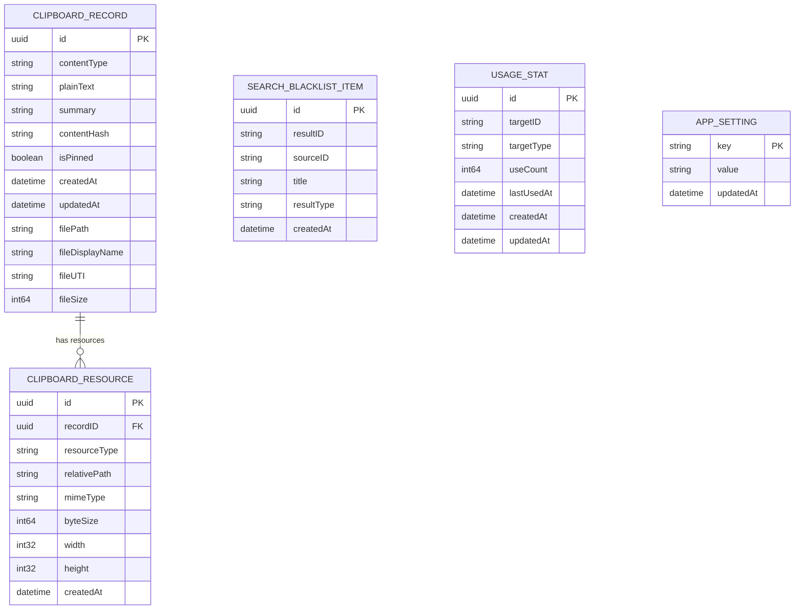

# Core Data 数据模型详细方案

## 版本记录

| 版本 | 上线日期 | 说明 |
|------|---------|------|
| v1.0.0 | 2026-07-02 | 首次上线，Mac Super Assistant MVP（22 个用户故事） |

## 修订记录

| 日期 | 修改人 | 备注 |
| :--- | :--- | :--- |
| 2026-06-05 | Claude | 初始版本：SnapVault SQLite + GRDB + FTS5 数据库设计 |
| 2026-06-11 | Claude | v2：按当前 Mac Super Assistant / Assistant MVP 架构重写为 Core Data + 文件系统数据模型设计 |

> 说明：本文件以 `doc/prd.md` 与 `doc/architecture.md` 当前 Assistant MVP 决策为准。旧 SQLite / GRDB / FTS5 方案不再作为 MVP 实现依据。

---

## 1. 方案目标

MVP 数据层采用 **Core Data + 文件系统 + 轻量内存搜索索引**。

目标：

1. 使用 Core Data 存储结构化数据：剪贴板历史元数据、文本、设置、黑名单、使用统计、资源引用等。
2. 使用文件系统存储大对象：图片原图、图片缩略图、RTF/HTML 原始格式等。
3. 使用内容 hash 支持剪贴板历史去重。
4. 使用置顶、保留时间和时间淘汰策略管理生命周期。
5. 支持启动时全量加载轻量索引字段到内存。
6. 避免将大对象直接塞入 Core Data，降低 store 膨胀风险。

---

## 2. 数据模型概览



---

## 3. Core Data Stack

### 3.1 Persistent Container

建议使用 `NSPersistentContainer`：

```swift
final class PersistenceController {
    static let shared = PersistenceController()

    let container: NSPersistentContainer

    var viewContext: NSManagedObjectContext {
        container.viewContext
    }
}
```

要求：

- Store 规范路径为 `~/Library/Application Support/Assistant/Assistant.sqlite`。
- `viewContext.automaticallyMergesChangesFromParent = true`。
- 后台写入使用 `container.performBackgroundTask`。
- UI 读取在 main context，服务写入在 background context。

### 3.2 Store 命名

建议：

```text
~/Library/Application Support/Assistant/
  Assistant.sqlite
  Assistant.sqlite-shm
  Assistant.sqlite-wal
```

`Assistant.sqlite` 是 Core Data 的 SQLite persistent store 文件名；`.sqlite-shm` / `.sqlite-wal` 是伴随文件。SQLite 仅作为 Core Data 持久化实现细节，业务层不得直接依赖 SQLite/GRDB/FTS5。

### 3.3 Migration 策略

MVP 使用 Core Data lightweight migration：

- 开启 `NSMigratePersistentStoresAutomaticallyOption`。
- 开启 `NSInferMappingModelAutomaticallyOption`。
- 每次模型变化更新 `.xcdatamodeld` 版本。
- 复杂迁移在后续版本引入 mapping model 或自定义迁移。

---

## 4. Entity：ClipboardRecord

### 4.1 用途

存储剪贴板历史主记录。大对象内容不直接存入该实体，而是通过 `ClipboardResource` 引用文件系统资源。

### 4.2 字段定义

| 字段 | 类型 | 必填 | 默认值 | 说明 |
| :--- | :--- | :--- | :--- | :--- |
| `id` | UUID | 是 | UUID() | 主键 |
| `contentType` | String | 是 | - | `text` / `richText` / `image` / `file` |
| `plainText` | String | 否 | nil | 文本内容；富文本展示/搜索也使用该字段 |
| `summary` | String | 否 | nil | 列表展示摘要，避免 UI 直接截取大文本 |
| `contentHash` | String | 是 | - | 内容 hash，用于去重 |
| `isPinned` | Bool | 是 | false | 是否置顶 |
| `createdAt` | Date | 是 | now | 首次记录时间 |
| `updatedAt` | Date | 是 | now | 最近复制/更新时间 |
| `filePath` | String | 否 | nil | 文件剪贴板的原始路径 |
| `fileDisplayName` | String | 否 | nil | 文件展示名 |
| `fileUTI` | String | 否 | nil | 文件类型标识 |
| `fileSize` | Int64 | 否 | 0 | 文件大小，仅记录元信息 |

### 4.3 关系

| Relationship | 目标 | 类型 | 删除规则 | 说明 |
| :--- | :--- | :--- | :--- | :--- |
| `resources` | `ClipboardResource` | To-Many | Cascade | 图片原图、缩略图、RTF/HTML 等资源 |

### 4.4 约束与索引

Core Data 约束：

- `contentHash` 应配置唯一约束或在 Repository 层保证唯一。

建议索引：

- `contentHash`
- `updatedAt`
- `contentType`
- `isPinned`

排序规则：

- 默认无搜索：`isPinned DESC, updatedAt DESC`。
- 搜索时：置顶匹配优先，其余按匹配度和时间综合排序（由内存索引层执行）。

---

## 5. Entity：ClipboardResource

### 5.1 用途

记录与剪贴板历史关联的大对象文件。

### 5.2 字段定义

| 字段 | 类型 | 必填 | 默认值 | 说明 |
| :--- | :--- | :--- | :--- | :--- |
| `id` | UUID | 是 | UUID() | 资源 id，也用于文件名 |
| `resourceType` | String | 是 | - | `imageOriginal` / `imageThumbnail` / `richTextRTF` / `richTextHTML` |
| `relativePath` | String | 是 | - | 相对 Application Support 的路径 |
| `mimeType` | String | 否 | nil | `image/png`, `text/html`, `application/rtf` 等 |
| `byteSize` | Int64 | 是 | 0 | 文件大小 |
| `width` | Int32 | 否 | 0 | 图片宽度，仅图片资源使用 |
| `height` | Int32 | 否 | 0 | 图片高度，仅图片资源使用 |
| `createdAt` | Date | 是 | now | 创建时间 |

### 5.3 关系

| Relationship | 目标 | 类型 | 删除规则 | 说明 |
| :--- | :--- | :--- | :--- | :--- |
| `record` | `ClipboardRecord` | To-One | Nullify / Cascade 由 record 侧控制 | 所属剪贴板记录 |

### 5.4 文件目录

MVP 文件系统目录：

```text
~/Library/Application Support/Assistant/
  Clipboard/
    Images/
      {uuid}.png
    Thumbnails/
      {uuid}.png
    RichText/
      {uuid}.rtf
      {uuid}.html
```

规则：

- 文件名使用 UUID。
- Core Data 保存相对路径或资源标识。
- 去重依赖 `ClipboardRecord.contentHash`，不依赖文件名。

---

## 6. Entity：SearchBlacklistItem

### 6.1 用途

记录用户隐藏的具体搜索结果。

MVP 黑名单只屏蔽具体结果，不支持规则黑名单。

### 6.2 字段定义

| 字段 | 类型 | 必填 | 默认值 | 说明 |
| :--- | :--- | :--- | :--- | :--- |
| `id` | UUID | 是 | UUID() | 主键 |
| `resultID` | String | 是 | - | 稳定搜索结果 id，如 app bundle id / command id / settings route |
| `sourceID` | String | 是 | - | Provider id |
| `title` | String | 是 | - | 展示名称，便于设置页管理 |
| `resultType` | String | 是 | - | application / command / setting 等 |
| `createdAt` | Date | 是 | now | 加入黑名单时间 |

### 6.3 约束与索引

唯一性建议：

```text
sourceID + resultID unique
```

索引：

- `sourceID`
- `resultID`

---

## 7. Entity：UsageStat

### 7.1 用途

记录应用和命令使用次数，用于搜索结果最近使用加权。

### 7.2 字段定义

| 字段 | 类型 | 必填 | 默认值 | 说明 |
| :--- | :--- | :--- | :--- | :--- |
| `id` | UUID | 是 | UUID() | 主键 |
| `targetID` | String | 是 | - | App bundle id/path 或 command id |
| `targetType` | String | 是 | - | `application` / `command` |
| `useCount` | Int64 | 是 | 0 | 使用次数 |
| `lastUsedAt` | Date | 否 | nil | 最近使用时间 |
| `createdAt` | Date | 是 | now | 创建时间 |
| `updatedAt` | Date | 是 | now | 更新时间 |

### 7.3 约束与索引

唯一性建议：

```text
targetType + targetID unique
```

索引：

- `targetID`
- `targetType`
- `lastUsedAt`
- `useCount`

---

## 8. Entity：AppSetting

### 8.1 用途

存储应用设置键值。

### 8.2 字段定义

| 字段 | 类型 | 必填 | 默认值 | 说明 |
| :--- | :--- | :--- | :--- | :--- |
| `key` | String | 是 | - | 设置键，主键语义 |
| `value` | String | 是 | - | JSON string 或简单字符串 |
| `updatedAt` | Date | 是 | now | 更新时间 |

### 8.3 默认设置项

| key | 默认值 | 说明 |
| :--- | :--- | :--- |
| `onboarding.completed` | `false` | 是否完成首次引导 |
| `hotkey.search` | `option+space` | 搜索快捷键 |
| `launchAtLogin.enabled` | `true` | 开机启动 |
| `clipboard.enabled` | `true` | 剪贴板记录功能开关 |
| `clipboard.showInSearch` | `true` | 剪贴板是否参与搜索展示 |
| `clipboard.retention` | `30d` | 保留时间持久化值：`7d` / `30d` / `90d` / `forever` |
| `search.source.app.enabled` | `true` | AppSource 展示开关 |
| `search.source.command.enabled` | `true` | CommandSource 展示开关 |
| `search.source.calculator.enabled` | `true` | CalculatorSource 展示开关 |
| `search.source.settings.enabled` | `true` | SettingsSource 展示开关 |
| `screenshot.saveDirectory` | `~/Pictures/Screenshots` | 截图保存目录 |
| `language.mode` | `system` | system / zh-Hans / en |

---

## 9. 内容 Hash 策略

### 9.1 文本

文本 hash 输入：

```text
text:<normalized plain text>
```

建议 normalization：

- 保留用户原文用于展示。
- hash 前统一换行符为 `\n`。
- 不做大小写折叠，避免不同大小写内容被错误合并。

### 9.2 富文本

富文本 hash 输入建议：

```text
richText:<plainTextHash>:<rtfHash?>:<htmlHash?>
```

说明：

- 展示和搜索使用纯文本。
- 原始 RTF/HTML 用于恢复格式。
- 若格式数据不可读，至少基于纯文本去重。

### 9.3 图片

图片 hash 输入：

```text
image:<image binary sha256>
```

建议对规范化 PNG 数据计算 hash，避免同图不同 pasteboard 表示导致误判。

### 9.4 文件引用

文件引用 hash 输入：

```text
file:<sorted absolute paths joined by \n>
```

多文件复制时路径排序后计算，避免顺序差异导致重复记录。

---

## 10. 写入流程

### 10.1 新剪贴板内容

```text
NSPasteboard changeCount 变化
  ├─ 读取 pasteboard 内容
  ├─ 识别类型：文本 / 富文本 / 图片 / 文件
  ├─ 生成 contentHash
  ├─ 查询 Core Data 是否已有记录
  │   ├─ 已存在：更新 updatedAt，保持 isPinned 状态
  │   └─ 不存在：写入 Core Data 记录和必要资源文件
  ├─ 更新内存搜索索引
  └─ 通知 UI 刷新
```

### 10.2 大对象写入顺序

建议顺序：

1. 生成 UUID。
2. 写文件到临时路径。
3. 原子移动到目标路径。
4. 写 Core Data resource 记录。
5. 写/更新 ClipboardRecord。
6. 更新内存索引。

如果 Core Data 写入失败，应清理本次新写入的临时文件或目标文件，避免明显孤儿文件。

---

## 11. 删除与清理策略

### 11.1 删除单条

删除 `ClipboardRecord` 时：

- 删除关联 `ClipboardResource` 记录。
- 尽力删除关联文件。
- 从内存索引移除。
- 删除失败不应导致 App 崩溃，应记录日志。

### 11.2 清空全部

- 必须二次确认。
- 文案提示不可撤销。
- 清空所有非系统设置数据：ClipboardRecord、ClipboardResource、相关文件。
- 搜索黑名单、设置、使用统计是否保留按设置页操作定义；MVP 清空剪贴板历史不应清空设置。

### 11.3 自动过期清理

- 只按时间淘汰，不按容量自动清理。
- 默认保留 30 天。
- 置顶项不自动删除。
- `forever` 表示不执行时间淘汰。

清理条件：

```text
isPinned == false AND updatedAt < cutoffDate
```

### 11.4 存储占用

存储占用统计包括：

- Core Data store 文件大小。
- `Clipboard/Images/`。
- `Clipboard/Thumbnails/`。
- `Clipboard/RichText/`。

MVP 显示占用，但不按容量自动清理。

---

## 12. 资源缺失容错

MVP 不做启动时主动一致性修复。

当 Core Data 记录存在但文件缺失：

- 历史项显示“资源已丢失”或等价提示。
- 复制/恢复时提示失败原因。
- 不自动删除该 Core Data 记录。
- 不主动清理孤儿文件。

后续版本可增加“修复数据”按钮或启动时轻量清理。

---

## 13. 内存索引数据结构

建议结构：

```swift
struct SearchIndexItem: Identifiable {
    let id: UUID
    let sourceID: String
    let recordID: UUID?
    let title: String
    let plainText: String?
    let summary: String?
    let contentType: String
    let pinyin: String?
    let initials: String?
    let updatedAt: Date
    let isPinned: Bool
    let contentHash: String?
    let resourceReferences: [UUID]
    let usageCount: Int
    let lastUsedAt: Date?
}
```

启动加载：

- 全量加载轻量字段。
- 不加载图片原图。
- 不加载 RTF/HTML 原始数据。

索引同步：

- 新增记录：append。
- 更新记录：replace。
- 删除记录：remove。
- 置顶变化：update `isPinned`。
- 清空历史：remove all clipboard source items。

---

## 14. 备份与导出

MVP 不要求实现数据导入导出。

后续如需导出，应考虑：

- Core Data 结构化元数据。
- 文件系统资源目录。
- 隐私风险提示。
- 大文件压缩包。

---

## 15. 风险与缓解

| 风险 | 影响 | 缓解 |
| :--- | :--- | :--- |
| Core Data 与文件系统不一致 | 历史项无法恢复 | MVP 做资源缺失容错；后续提供修复工具 |
| 内存索引过大 | 内存占用升高 | MVP 只加载轻量字段；后续可做分层索引 |
| 图片/富文本文件过多 | 磁盘占用增长 | 显示存储占用；按时间清理；提供清空入口 |
| 富文本恢复失败 | 复制体验下降 | 失败降级纯文本 |
| hash 去重误判 | 记录错误合并 | 类型前缀 + 规范化输入；保留原始数据用于恢复 |

---

## 16. 变更记录

| 日期 | 变更内容 |
| :--- | :--- |
| 2026-06-11 | v2：重写数据库详细方案为 Core Data + 文件系统。新增 ClipboardRecord、ClipboardResource、SearchBlacklistItem、UsageStat、AppSetting 实体设计；定义大对象目录、UUID 文件命名、contentHash 去重、内存索引、时间清理、资源缺失容错。 |
