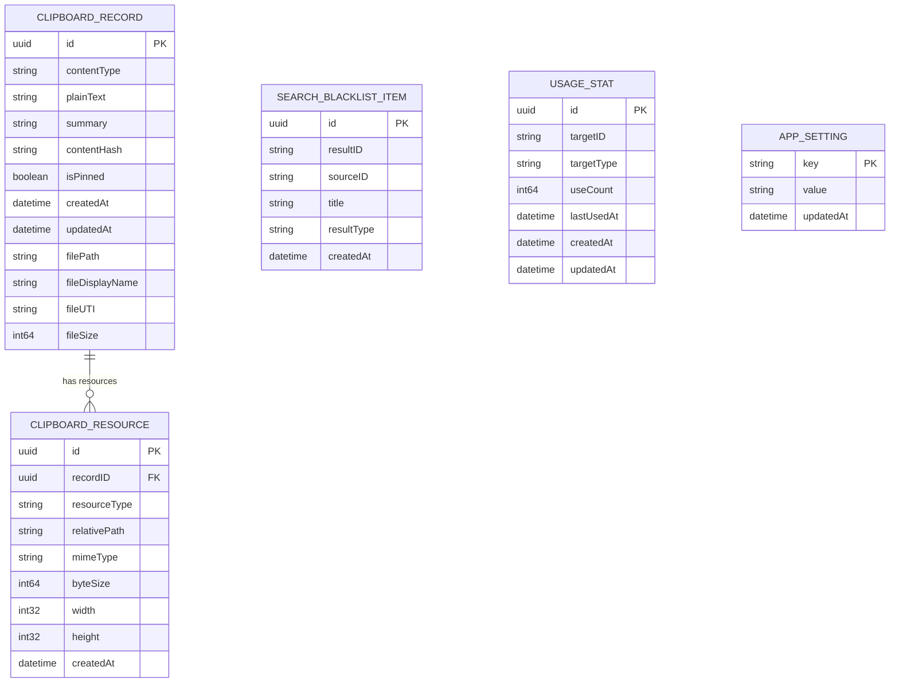

# 青鸟 Qingniao 数据模型详细方案

> 版本：**v3** · 关联：`doc/architecture/design.md`（v17）、`doc/architecture/api.md`（v3）、`doc/prd.md`（青鸟 v1.2）

## 版本记录

| 版本 | 上线日期 | 说明 |
|------|---------|------|
| v1.0.0 | 2026-07-02 | 首次上线，MVP（Core Data + 文件系统） |
| v1.2.0 | 2026-07-03 | 数据目录 Assistant → Qingniao（旧目录 move 迁移）；删除 OCR 字段/表；双栈技术债标注（Core Data 活动、GRDB 遗留只读）；AppSetting 默认值更新（onboardingCompletedAt/appearanceMode/dataFolderBookmark/截图热键）；新增"清空所有数据"流程 |

## 修订记录

| 日期 | 修改人 | 备注 |
| :--- | :--- | :--- |
| 2026-06-05 → 2026-06-11 | Claude | v1–v2：SnapVault GRDB/FTS5 → Assistant Core Data + 文件系统数据模型 |
| 2026-07-03 | arch subagent | **v3：数据目录 `~/Library/Application Support/Assistant/` → `.../Qingniao/`（启动时旧目录存在则 move，非 copy；Core Data lightweight migration，失败 fallback 新建空库 + 备份旧库）；删除 `ClipboardRecord.ocrText` 与 `DatabaseManager` OCR 表/迁移及 OCR 相关索引（读旧数据忽略）；明确 Core Data 为活动栈、GRDB 相关表 v1.2 保持兼容但不再写入（技术债，V1.x 移除）；`AppSetting` 默认值更新（`onboarding.completedAt`/`appearance.mode`/`data.folderBookmark`/三截图热键/`search.source.file.enabled`；`clipboard.enabled=true` 保持 v1.1 决策）；删除 ContentRepository/ContentStore schema 描述（标注历史）；新增"清空所有数据"与"打开数据目录"说明；风险表更新。** |

> 本文件以 `doc/prd.md` 与 `doc/architecture/design.md` 当前青鸟 v1.2 决策为准。**Core Data + 文件系统为活动数据层**；旧 SnapVault SQLite/GRDB/FTS5 主存储方案不作为实现依据，GRDB 仅作为待清理的历史遗留栈标注。

---

## 1. 方案目标

1. Core Data 存储结构化数据（剪贴板历史元数据、文本、设置、黑名单、使用统计、资源引用）。
2. 文件系统存储大对象（图片原图、缩略图、RTF/HTML）。
3. 内容 hash 去重；置顶 + 保留时间 + 时间淘汰管理生命周期。
4. 启动时全量加载轻量索引字段到内存。
5. 数据目录随品牌改名迁移到 Qingniao，历史数据不丢失。
6. 标注并隔离 GRDB 双栈技术债，v1.2 不重构、不再写入。

---

## 2. 数据模型概览



> **注（v1.2）**：`ClipboardRecord` 已移除 `ocrText` 字段（OCR 死代码清理）。上图为清理后的活动模型。

---

## 3. Core Data Stack

### 3.1 Persistent Container

```swift
final class PersistenceController {
    static let shared = PersistenceController()
    let container: NSPersistentContainer
    var viewContext: NSManagedObjectContext { container.viewContext }
}
```

要求：

- Store 规范路径 `~/Library/Application Support/Qingniao/Qingniao.sqlite`（v1.2 改名，见 §8）。
- `viewContext.automaticallyMergesChangesFromParent = true`。
- 后台写入 `performBackgroundTask`；UI 读 main context，服务写 background context。

### 3.2 Store 命名

```text
~/Library/Application Support/Qingniao/
  Qingniao.sqlite
  Qingniao.sqlite-shm
  Qingniao.sqlite-wal
```

- `Qingniao.sqlite` 是 Core Data 的 SQLite persistent store；SQLite 仅为 Core Data 实现细节，业务层不直接依赖 SQLite/GRDB/FTS5。
- 旧 `Assistant.sqlite`（及 -shm/-wal）在迁移时随目录 move 后按新名重命名（见 §8.3）。

### 3.3 Migration 策略

- Core Data lightweight migration：`NSMigratePersistentStoresAutomaticallyOption` + `NSInferMappingModelAutomaticallyOption`。
- 每次模型变化更新 `.xcdatamodeld` 版本。
- **v1.2 模型变化**：删除 `ClipboardRecord.ocrText`（属性删除，lightweight migration 可自动推断）。
- 复杂迁移在后续版本用 mapping model / 自定义迁移。

---

## 4. Entity：ClipboardRecord

### 4.1 用途

剪贴板历史主记录。大对象经 `ClipboardResource` 引用文件系统。

### 4.2 字段定义（v1.2：已删除 ocrText）

| 字段 | 类型 | 必填 | 默认值 | 说明 |
| :--- | :--- | :--- | :--- | :--- |
| `id` | UUID | 是 | UUID() | 主键 |
| `contentType` | String | 是 | - | `text` / `richText` / `image` / `file` |
| `plainText` | String | 否 | nil | 文本内容；富文本展示/搜索也用该字段 |
| `summary` | String | 否 | nil | 列表展示摘要 |
| `contentHash` | String | 是 | - | 内容 hash，用于去重 |
| `isPinned` | Bool | 是 | false | 是否置顶 |
| `createdAt` | Date | 是 | now | 首次记录时间 |
| `updatedAt` | Date | 是 | now | 最近复制/更新时间 |
| `filePath` | String | 否 | nil | 文件剪贴板原始路径 |
| `fileDisplayName` | String | 否 | nil | 文件展示名 |
| `fileUTI` | String | 否 | nil | 文件类型标识 |
| `fileSize` | Int64 | 否 | 0 | 文件大小元信息 |
| ~~`ocrText`~~ | ~~String~~ | — | — | **v1.2 删除**：OCR 从未接线，死代码清理；读旧数据忽略该列 |

### 4.3 关系

| Relationship | 目标 | 类型 | 删除规则 | 说明 |
| :--- | :--- | :--- | :--- | :--- |
| `resources` | `ClipboardResource` | To-Many | Cascade | 图片原图/缩略图/RTF/HTML |

### 4.4 约束与索引

- `contentHash` 唯一约束或 Repository 层保证唯一。
- 建议索引：`contentHash`、`updatedAt`、`contentType`、`isPinned`。
- **删除任何 OCR 相关索引**（若存在）。
- 排序：默认 `isPinned DESC, updatedAt DESC`；搜索时置顶匹配优先（内存索引层执行）。

---

## 5. Entity：ClipboardResource

沿用 v2：`id`（UUID，兼文件名）/`resourceType`（imageOriginal/imageThumbnail/richTextRTF/richTextHTML）/`relativePath`/`mimeType`/`byteSize`/`width`/`height`/`createdAt`；`record` To-One。

文件目录（数据根改 Qingniao）：

```text
~/Library/Application Support/Qingniao/
  Clipboard/
    Images/{uuid}.png
    Thumbnails/{uuid}.png
    RichText/{uuid}.rtf | {uuid}.html
```

UUID 命名；Core Data 存相对路径；去重依赖 `contentHash` 不依赖文件名。

---

## 6. Entity：SearchBlacklistItem

沿用 v2：`id`/`resultID`/`sourceID`/`title`/`resultType`/`createdAt`；唯一性 `sourceID + resultID`；索引 `sourceID`/`resultID`。

> v1.2：文件搜索结果（`resultType=file`、`resultID="file:<pathHash>"`）同样可加入黑名单，schema 不变。

---

## 7. Entity：UsageStat

沿用 v2：`id`/`targetID`/`targetType`(application/command)/`useCount`/`lastUsedAt`/`createdAt`/`updatedAt`；唯一性 `targetType + targetID`；索引 `targetID`/`targetType`/`lastUsedAt`/`useCount`。

> **保留**（PRD P-03 概览页）：用于"概览页"统计（使用天数、日均启动、剪贴数、截图数）。v1.2 概览页统计数据来源即 UsageStat + 剪贴板计数 + 截图计数（截图数可由 UsageStat 扩展 targetType 或单独计数键记录，实现留开发）。

---

## 8. Entity：AppSetting

### 8.1 用途

存储应用设置键值。

### 8.2 字段定义

| 字段 | 类型 | 必填 | 默认值 | 说明 |
| :--- | :--- | :--- | :--- | :--- |
| `key` | String | 是 | - | 设置键，主键语义 |
| `value` | String | 是 | - | JSON string 或简单字符串 |
| `updatedAt` | Date | 是 | now | 更新时间 |

### 8.3 默认设置项（v1.2 更新）

| key | 默认值 | 说明 |
| :--- | :--- | :--- |
| `onboarding.completedAt` | `nil`（未设置） | **v1.2 新增，取代 `onboarding.completed` 布尔**：`Date?`，非空即已完成/跳过，用于重启不重弹判定（AC-6）。迁移时若旧 `onboarding.completed==true`，写入一个非空时间戳 |
| `hotkey.search` | `option+space` | 搜索快捷键 |
| `hotkey.capture.region` | `shift+ctrl+cmd+4` | **v1.2 新增**：区域截图热键 |
| `hotkey.capture.window` | `shift+ctrl+cmd+5` | **v1.2 新增**：窗口截图热键 |
| `hotkey.capture.fullscreen` | `ctrl+option+cmd+3` | **v1.2 新增**：全屏截图热键（D-107） |
| `launchAtLogin.enabled` | `true` | 开机启动 |
| `clipboard.enabled` | `true` | **保持 v1.1 修正后的决策**（PersistenceController 默认 "true"；跳过 onboarding 时代码需显式处理） |
| `clipboard.showInSearch` | `true` | 剪贴板参与搜索展示 |
| `clipboard.retention` | `30d` | `7d`/`30d`/`90d`/`forever` |
| `search.source.app.enabled` | `true` | AppSource 展示开关 |
| `search.source.command.enabled` | `true` | CommandSource 展示开关 |
| `search.source.calculator.enabled` | `true` | CalculatorSource 展示开关 |
| `search.source.settings.enabled` | `true` | SettingsSource 展示开关 |
| `search.source.file.enabled` | `true` | **v1.2 新增**：FileSearchSource 展示开关 |
| `screenshot.saveDirectory` | `~/Pictures/Screenshots` | 截图保存目录（P-05 另有"上次目录"运行态，默认 `~/Desktop`） |
| `appearance.mode` | `system` | **v1.2 新增**：`system`/`light`/`dark`（外观页） |
| `data.folderBookmark` | `nil` | **v1.2 新增**：安全书签 `Data?`，指向用户改的截图/数据目录（关闭 Sandbox 后仍用书签持久化用户选择路径） |
| `language.mode` | `system` | `system`/`zh-Hans`/`en` |

> **移除**：旧 `onboarding.completed`（布尔）语义由 `onboarding.completedAt` 取代；任何 OCR 相关设置键删除。

### 8.4 数据目录改名迁移（v1.2 核心）

品牌改名后数据目录由 `Assistant/` 改为 `Qingniao/`。Bundle ID 保留 `com.assistant.app`，但 Application Support 子目录名可自由命名（与 Bundle ID 无强绑定），因此迁移目录名。

**启动迁移流程**：

```text
App 启动
  ├─ 检测新目录 ~/Library/Application Support/Qingniao/ 是否存在
  │   ├─ 存在：直接使用（已迁移或全新安装）
  │   └─ 不存在：
  │       ├─ 检测旧目录 ~/Library/Application Support/Assistant/ 是否存在
  │       │   ├─ 存在：move（重命名/移动，非 copy）整个目录 Assistant → Qingniao
  │       │   │        将 Assistant.sqlite(-shm/-wal) 重命名为 Qingniao.sqlite(-shm/-wal)
  │       │   └─ 不存在：全新安装，创建空 Qingniao/ 目录结构
  ├─ 加载 Core Data store（lightweight migration：删除 ocrText 属性自动推断）
  │   └─ 若 migration 失败：fallback —— 备份旧 store（重命名为 Qingniao.sqlite.bak-<timestamp>）
  │                          + 新建空库，保证 App 可启动，不阻塞用户
  └─ 迁移旧 onboarding.completed → onboarding.completedAt（若旧为 true 写非空时间戳）
```

- 使用 move（非 copy）避免数据翻倍与两处不一致。
- 迁移失败不得导致 App 无法启动：失败即 fallback 到新建空库 + 备份旧库，并可提示用户旧数据已备份。
- 与 Time Machine 兼容，不设排除标志。

---

## 9. 内容 Hash 策略

沿用 v2：文本 `text:<normalized>`（统一换行、不折叠大小写）、富文本 `richText:<plainTextHash>:<rtfHash?>:<htmlHash?>`、图片 `image:<sha256>`（规范化 PNG）、文件 `file:<sorted abs paths>`。不变更。

---

## 10. 写入流程

沿用 v2：changeCount 变化 → 读取 → 识别类型 → 生成 hash → 查重（存在更新 updatedAt/保持 pin；不存在写记录+资源）→ 更新内存索引 → 通知 UI。大对象写入顺序：生成 UUID → 写临时 → 原子移动 → 写 resource → 写/更新 record → 更新索引；Core Data 写失败清理本次临时/目标文件。

**v1.2 双栈一致性容错**：写入路径只写 Core Data；若代码路径仍触及 GRDB 遗留表（历史遗留），以 try/catch 容错，失败降级不崩溃、不影响 Core Data 写入结果（Core Data 为事实来源）。

---

## 11. 删除与清理策略

### 11.1 删除单条 / 11.3 自动过期 / 11.4 存储占用

沿用 v2：删单条（删关联资源+文件、移出索引、失败记录日志）；自动过期只按时间（默认 30 天，`isPinned==false AND updatedAt < cutoff`，`forever` 不淘汰，置顶不删）；存储占用统计 Core Data store + Clipboard 三目录。

### 11.2 清空全部剪贴板历史

沿用 v2：二次确认、文案"不可撤销"；清空 ClipboardRecord/ClipboardResource + 相关文件；不清设置/黑名单/使用统计。

### 11.5 清空所有数据（v1.2 新增，设置"数据"页）

对应 PRD FR-UNINSTALL-2 / §7.13、design §3.6。区别于"清空剪贴板历史"，这是彻底重置：

```text
清空所有数据（二次确认，不可撤销）
  ├─ 删除 Core Data sqlite（Qingniao.sqlite / -shm / -wal）
  ├─ 删除文件资源目录（Clipboard/Images|Thumbnails|RichText）
  ├─ 清除 UserDefaults / AppSetting 全部键（回到默认）
  └─ 重启 App（或提示用户重启）
```

- 失败抛 `QingniaoError.dataResetFailed`。
- "打开数据目录"：Finder 打开 `~/Library/Application Support/Qingniao/`（不删数据）。
- 导出数据：v1.2 仅占位入口，本体列 V1.x（FR-DATA-EXPORT-BACKUP）。

---

## 12. 资源缺失容错

沿用 v2：记录存在但文件缺失 → 显示"资源已丢失"，复制/恢复提示失败原因；不自动删记录、不清孤儿文件。后续可加"修复数据"。

---

## 13. 内存索引数据结构

沿用 v2 `SearchIndexItem`（轻量字段，不含大对象；append/replace/remove/pin/clear 同步）。不含 OCR 字段。

---

## 14. 双数据栈技术债说明（v1.2 新增）

- **活动栈**：Core Data（`PersistenceController`）+ 文件系统。剪贴板写入/历史/设置/黑名单/使用统计均在此。
- **遗留栈**：GRDB（`DatabaseManager`）曾用于全文搜索/导出/清理，与 Core Data 双栈并存、无同步机制。**v1.2 决策：不重构**；GRDB 相关表保持存在以兼容旧数据但**不再写入**。
- **已删除的 GRDB 侧死代码**：`ClipboardRepository`(GRDB)、`ContentRepository`、`ContentStore`、`OCRService` 及 `DatabaseManager` 内 OCR 表/迁移/OCR 相关索引（见 api.md Removed 表）。
- **旧 schema 标注为历史**：`ContentRepository`/`ContentStore` 相关表（如 `RecentContent` 及其 OCR 列）属 v1.1 及以前历史，不再作为活动 schema；v1.2 保留读兼容（如仍有旧数据）但不写入。
- **V1.x 方向**：统一到单栈（SwiftData 或单 Core Data），彻底移除 GRDB，消除一致性风险（迁移时机/验收见 PRD 第 16 章 #6）。

---

## 15. 备份与导出

- 数据目录 `~/Library/Application Support/Qingniao/` 与 Time Machine 兼容，随系统备份，不设排除标志。
- v1.2 提供"打开数据目录"（Finder）；**主动导出/备份能力列 V1.x**（FR-DATA-EXPORT-BACKUP），v1.2 不实现，仅本章说明存储位置与迁移策略避免误解。
- 后续导出应考虑：Core Data 结构化元数据 + 文件资源目录 + 隐私提示 + 压缩包。

---

## 16. 风险与缓解

| 风险 | 影响 | 缓解 |
| :--- | :--- | :--- |
| **数据目录改名迁移失败** | 历史剪贴板/设置丢失或 App 无法启动 | move（非 copy）；lightweight migration 失败 fallback 新建空库 + 备份旧库；启动不阻塞；提示已备份 |
| **双栈（Core Data + GRDB）一致性** | 同一记录展示不一致 | Core Data 为事实来源；v1.2 不再写 GRDB；写入命中遗留表容错不崩溃；V1.x 统一单栈 |
| Core Data + 内存索引不一致 | 搜索与持久化不一致 | Core Data 事实来源；索引可重建；变更后同步 |
| 图片/富文本大对象增长 | 磁盘占用 | 显示占用；按时间清理；清空入口 |
| 富文本恢复失败 | 复制体验下降 | 失败降级纯文本 |
| hash 去重误判 | 记录错误合并 | 类型前缀 + 规范化输入；保留原始数据 |
| 删除 ocrText 属性迁移 | 迁移不兼容旧库 | 属性删除 lightweight migration 可自动推断；读旧数据忽略该列 |

---

## 17. 变更记录

| 日期 | 变更内容 |
| :--- | :--- |
| 2026-06-11 | v2：重写为 Core Data + 文件系统数据模型。 |
| 2026-07-03 · **v3** | 数据目录 `Assistant/` → `Qingniao/`（启动时旧目录存在则 move；store 重命名 `Assistant.sqlite`→`Qingniao.sqlite`；lightweight migration 失败 fallback 新建空库 + 备份旧库）；**删除 `ClipboardRecord.ocrText` 及 OCR 相关索引/表/迁移**（读旧数据忽略）；`AppSetting` 默认值更新（新增 `onboarding.completedAt` 取代 `onboarding.completed`、`appearance.mode`、`data.folderBookmark`、三截图热键键、`search.source.file.enabled`；`clipboard.enabled=true` 保持）；`UsageStat` 保留用于概览页统计；新增"清空所有数据"（删 sqlite + 资源目录 + UserDefaults + 重启，失败 `dataResetFailed`）与"打开数据目录"；明确 Core Data 活动栈 / GRDB 遗留只读技术债；删除 `ContentRepository`/`ContentStore` schema（标注历史）；风险表新增迁移失败与双栈一致性。 |
