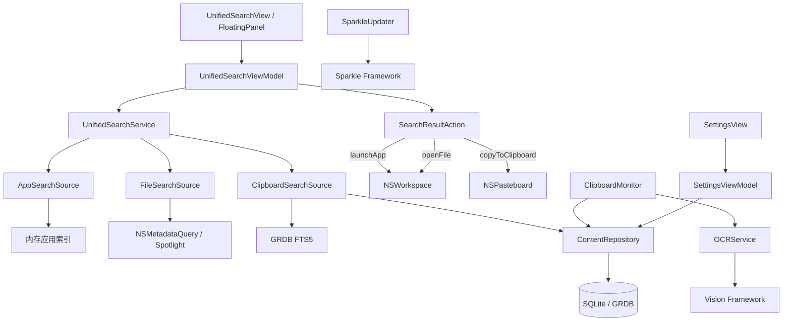

# 接口设计详细方案

## 方案目标

定义 SnapVault 各模块之间的内部接口契约，确保模块解耦、职责清晰。本文档描述的是 Swift Protocol 形式的内部 API，不涉及外部网络接口（SnapVault 是纯本地应用）。

## 通用约定

### 模块通信方式

- **同步调用**：直接 Protocol 方法调用（同一线程内）
- **异步调用**：使用 Swift `async/await`
- **事件通知**：使用 `Combine` 的 `Publisher` 或 `AsyncSequence`
- **依赖注入**：通过 Protocol 注入，方便测试和替换

### 错误处理

所有可能失败的操作返回 `Result<T, SnapVaultError>` 或 `throws SnapVaultError`：

```swift
enum SnapVaultError: LocalizedError {
    case databaseError(underlying: Error)
    case ocrFailed(reason: String)
    case clipboardAccessDenied
    case itemNotFound(id: Int64)
    case storageLimitExceeded
}
```

## 接口详细定义

### ClipboardMonitorProtocol

**职责**：监听系统剪贴板变化，发布新内容事件。

```swift
protocol ClipboardMonitorProtocol {
    /// 剪贴板变化事件流
    var onNewContent: AsyncStream<ClipboardEvent> { get }

    /// 开始监听
    func start()

    /// 停止监听
    func stop()

    /// 手动触发一次检查（用于测试）
    func pollNow() async
}

struct ClipboardEvent {
    let contentType: ContentType
    let textContent: String?
    let imageData: Data?
    let fileURLs: [URL]?
    let contentHash: String
    let timestamp: Date
}

enum ContentType: String, Codable {
    case text, rtf, image, file
}
```

### ContentRepositoryProtocol

**职责**：剪贴板内容的持久化存储与查询。

```swift
protocol ContentRepositoryProtocol {
    /// 保存一条剪贴板记录
    func save(_ item: ClipboardItem) async throws -> Int64

    /// 查询历史记录（分页）
    func fetchHistory(
        page: Int,
        pageSize: Int,
        contentType: ContentType?,
        pinnedOnly: Bool
    ) async throws -> [ClipboardItem]

    /// 全文搜索
    func search(query: String, limit: Int) async throws -> [ClipboardItem]

    /// 获取单条记录
    func fetch(id: Int64) async throws -> ClipboardItem?

    /// 根据 hash 查找重复记录
    func findByHash(_ hash: String) async throws -> ClipboardItem?

    /// 置顶/取消置顶
    func togglePin(id: Int64) async throws

    /// 删除记录
    func delete(id: Int64) async throws

    /// 批量删除
    func delete(ids: [Int64]) async throws

    /// 清理过期数据
    func cleanup(retentionDays: Int, maxStorageMB: Int) async throws -> Int

    /// 获取统计信息
    func getStats() async throws -> StorageStats
}

struct ClipboardItem: Identifiable, Codable {
    let id: Int64
    let contentType: ContentType
    let textContent: String?
    let rtfContent: String?
    let imageData: Data?
    let filePath: String?
    let ocrText: String?
    let contentHash: String
    let isPinned: Bool
    let createdAt: Date
    let updatedAt: Date
}

struct StorageStats {
    let totalItems: Int
    let totalSizeMB: Double
    let itemsByType: [ContentType: Int]
}
```

### OCRServiceProtocol

**职责**：对图片执行 OCR 文字识别。

```swift
protocol OCRServiceProtocol {
    /// 识别图片中的文字
    /// - Parameters:
    ///   - imageData: 图片二进制数据
    ///   - languages: 识别语言（默认中英文混合）
    /// - Returns: 识别出的文本及置信度
    func recognizeText(
        from imageData: Data,
        languages: [String]
    ) async throws -> OCRResult
}

struct OCRResult {
    let text: String           // 拼接后的完整文本
    let confidence: Float      // 平均置信度 (0-1)
    let blocks: [TextBlock]    // 分块结果（供高级用例）
}

struct TextBlock {
    let text: String
    let confidence: Float
    let boundingBox: CGRect
}
```

### SearchSource（统一搜索源协议）

**职责**：所有搜索源的统一接口，实现可插拔架构。

```swift
/// 搜索源类型
enum SearchResultType: String, Codable, CaseIterable {
    case application   // 已安装应用
    case file          // 本地文件
    case clipboard     // 剪贴板历史

    var displayName: String {
        switch self {
        case .application: return "应用"
        case .file: return "文件"
        case .clipboard: return "剪贴板"
        }
    }

    var iconName: String {
        switch self {
        case .application: return "app.fill"
        case .file: return "doc.fill"
        case .clipboard: return "clipboard.fill"
        }
    }
}

/// 统一搜索结果
struct UnifiedSearchResult: Identifiable {
    let id: String                // 唯一标识（sourceType:原始ID）
    let title: String             // 主标题
    let subtitle: String?         // 副标题
    let icon: NSImage?            // 图标
    let type: SearchResultType    // 结果类型
    let score: Double             // 综合排序分数 (0-1)
    let highlightRanges: [NSRange] // 高亮位置
    let action: SearchResultAction // 选择后的动作
}

/// 搜索结果动作
enum SearchResultAction {
    case launchApp(bundleID: String, path: URL)
    case openFile(path: URL)
    case openInFinder(path: URL)
    case copyToClipboard(itemID: Int64)
}

/// 搜索源协议
protocol SearchSource {
    /// 此搜索源的结果类型
    var sourceType: SearchResultType { get }

    /// 搜索
    /// - Parameters:
    ///   - query: 搜索关键词
    ///   - limit: 最大返回条数
    /// - Returns: 统一格式的搜索结果
    func search(query: String, limit: Int) async throws -> [UnifiedSearchResult]
}
```

### UnifiedSearchServiceProtocol

**职责**：统一搜索入口，聚合所有搜索源，排序分组。

```swift
protocol UnifiedSearchServiceProtocol {
    /// 注册搜索源
    func registerSource(_ source: SearchSource)

    /// 统一搜索
    /// - Parameters:
    ///   - query: 搜索关键词
    ///   - limit: 每个源的最大返回条数
    /// - Returns: 合并排序后的结果，按类型分组
    func search(query: String, limit: Int) async throws -> UnifiedSearchResponse

    /// 记录用户选择（用于提升排名）
    func recordSelection(resultID: String)
}

struct UnifiedSearchResponse {
    let applications: [UnifiedSearchResult]  // 应用结果
    let files: [UnifiedSearchResult]         // 文件结果
    let clipboard: [UnifiedSearchResult]     // 剪贴板结果
    let totalCount: Int
    let elapsed: TimeInterval                // 搜索耗时(ms)
}
```

### AppSearchSourceProtocol

**职责**：已安装应用搜索，基于内存索引。

```swift
protocol AppSearchSourceProtocol: SearchSource {
    /// 构建/刷新应用索引
    func rebuildIndex() async

    /// 获取应用信息
    func getAppInfo(bundleID: String) -> AppInfo?
}

struct AppInfo {
    let name: String              // 应用名称
    let bundleID: String          // Bundle Identifier
    let path: URL                 // .app 路径
    let icon: NSImage?            // 应用图标
    let lastUsed: Date?           // 最后使用时间
    let useCount: Int             // 使用次数
}
```

### FileSearchSourceProtocol

**职责**：本地文件搜索，基于 Spotlight NSMetadataQuery。

```swift
protocol FileSearchSourceProtocol: SearchSource {
    /// 设置搜索范围（默认用户主目录）
    func setSearchScope(_ paths: [URL])

    /// 设置文件类型过滤
    func setFileTypes(_ types: [String])  // UTI 类型
}

struct FileInfo {
    let name: String              // 文件名
    let path: URL                 // 文件路径
    let contentType: String       // UTI 类型
    let size: Int64               // 文件大小(bytes)
    let modifiedDate: Date        // 修改日期
    let icon: NSImage?            // 文件图标
}
```

### ExportServiceProtocol

**职责**：数据导出功能。

```swift
protocol ExportServiceProtocol {
    /// 导出为 JSON 文件
    func exportToJSON(items: [ClipboardItem]) async throws -> URL

    /// 导出为 CSV 文件
    func exportToCSV(items: [ClipboardItem]) async throws -> URL

    /// 导出数据库文件
    func exportDatabase() async throws -> URL
}
```

### UpdateServiceProtocol

**职责**：应用更新管理。

```swift
protocol UpdateServiceProtocol {
    /// 检查是否有可用更新
    func checkForUpdates() async throws -> UpdateInfo?

    /// 启动自动更新检查（由 Sparkle 驱动）
    func startAutoUpdateCheck(interval: TimeInterval)

    /// 手动触发更新检查
    func checkNow()
}

struct UpdateInfo {
    let version: String
    let releaseNotes: String
    let downloadURL: URL
    let isCritical: Bool
}
```

## ViewModel 接口

### UnifiedSearchViewModel

**职责**：统一搜索界面的 ViewModel，管理搜索输入、结果展示、用户选择。

```swift
@MainActor
class UnifiedSearchViewModel: ObservableObject {
    @Published var searchText: String = ""
    @Published var applications: [UnifiedSearchResult] = []
    @Published var files: [UnifiedSearchResult] = []
    @Published var clipboard: [UnifiedSearchResult] = []
    @Published var isLoading: Bool = false
    @Published var selectedResult: UnifiedSearchResult?
    @Published var elapsed: TimeInterval = 0

    /// 执行搜索（300ms debounce）
    func search() async

    /// 用户选择结果
    func select(_ result: UnifiedSearchResult)

    /// 键盘导航（上/下/回车）
    func moveSelectionUp()
    func moveSelectionDown()
    func confirmSelection()
}
```

### ClipboardListViewModel

```swift
@MainActor
class ClipboardListViewModel: ObservableObject {
    @Published var items: [ClipboardItem] = []
    @Published var searchText: String = ""
    @Published var selectedContentType: ContentType?
    @Published var isLoading: Bool = false

    func loadMore() async
    func deleteItem(_ item: ClipboardItem) async
    func togglePin(_ item: ClipboardItem) async
    func copyToClipboard(_ item: ClipboardItem)
}
```

### SettingsViewModel

```swift
@MainActor
class SettingsViewModel: ObservableObject {
    @Published var retentionDays: Int = 30
    @Published var maxStorageMB: Int = 500
    @Published var ocrEnabled: Bool = true
    @Published var pollInterval: Double = 500

    func save() async
    func resetToDefaults() async
    func exportData() async throws -> URL
    func importData(from url: URL) async throws
}
```

## 依赖关系图



## 变更记录

| 日期       | 变更内容 |
| :--------- | :------- |
| 2026-06-05 | 初始版本：核心 Protocol 定义、ViewModel 接口、依赖关系 |
| 2026-06-05 | v2：增加 SearchSource 统一协议、AppSearchSource、FileSearchSource、UnifiedSearchService、UnifiedSearchViewModel，重构依赖关系图 |
