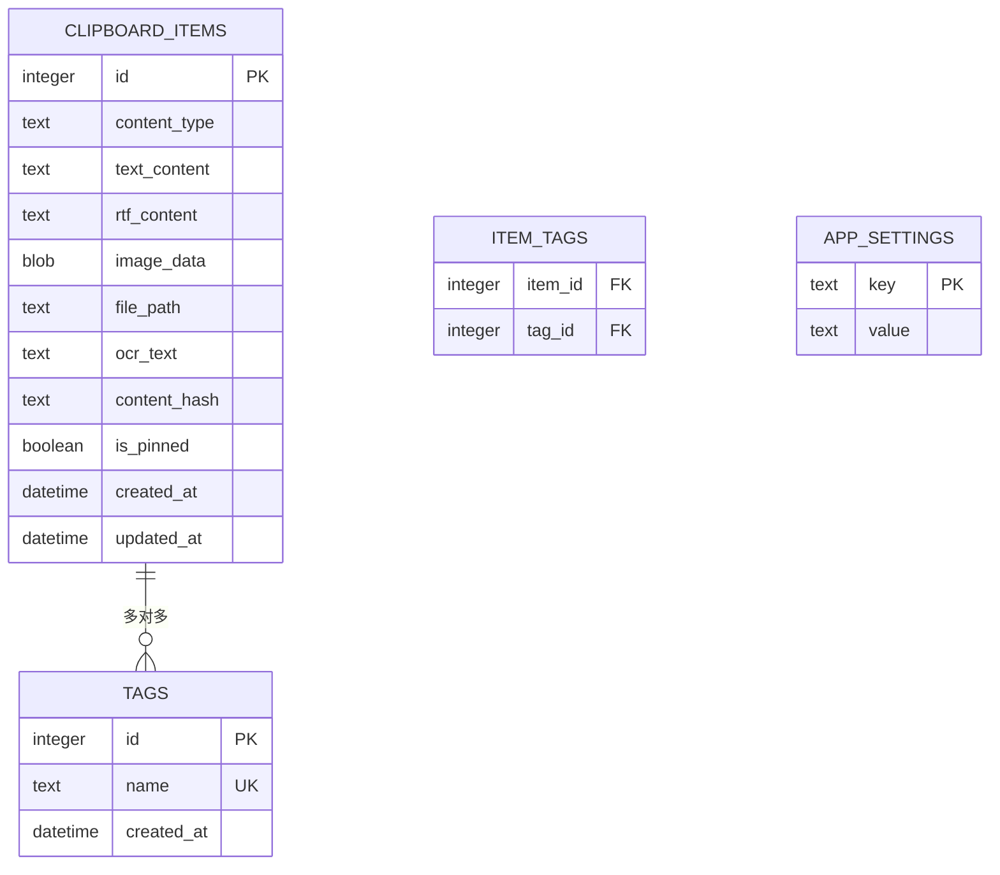

# 数据库设计详细方案

## 方案目标

基于 SQLite + GRDB 设计本地数据存储方案，满足剪贴板历史记录的高频写入、全文搜索、自动清理等需求。使用 GRDB 的 Migration 机制管理 schema 版本演进。

## 数据模型概览



## 表结构定义

### clipboard_items

**用途**：存储所有剪贴板历史记录，是系统的核心数据表。

| 字段          | 类型     | 约束                         | 说明                                 |
| :------------ | :------- | :--------------------------- | :----------------------------------- |
| id            | INTEGER  | PK, AUTOINCREMENT            | 主键                                 |
| content_type  | TEXT     | NOT NULL, INDEX              | 内容类型：`text` / `rtf` / `image` / `file` |
| text_content  | TEXT     |                              | 纯文本内容（text 类型时有值）         |
| rtf_content   | TEXT     |                              | RTF 富文本内容（rtf 类型时有值）      |
| image_data    | BLOB     |                              | 图片二进制数据（image 类型时有值）    |
| file_path     | TEXT     |                              | 文件路径（file 类型时有值）           |
| ocr_text      | TEXT     |                              | OCR 识别出的文字（image 类型时填充）  |
| content_hash  | TEXT     | NOT NULL, INDEX              | 内容 SHA256 哈希，用于去重            |
| is_pinned     | INTEGER  | NOT NULL, DEFAULT 0          | 是否置顶（0=否, 1=是）               |
| created_at    | TEXT     | NOT NULL, DEFAULT CURRENT_TIMESTAMP | 创建时间（ISO 8601）            |
| updated_at    | TEXT     | NOT NULL, DEFAULT CURRENT_TIMESTAMP | 最后更新时间                    |

**索引设计：**

| 索引名                      | 字段                      | 类型  | 理由                           |
| :-------------------------- | :------------------------ | :---- | :----------------------------- |
| idx_clipboard_content_hash  | content_hash              | BTREE | 去重查询                       |
| idx_clipboard_created_at    | created_at DESC           | BTREE | 按时间倒序查询（最常用）        |
| idx_clipboard_content_type  | content_type              | BTREE | 按类型筛选                     |
| idx_clipboard_is_pinned     | is_pinned                 | BTREE | 置顶项查询                     |

### clipboard_items_fts

**用途**：FTS5 虚拟表，用于全文搜索 text_content 和 ocr_text。

```sql
CREATE VIRTUAL TABLE clipboard_items_fts USING fts5(
    text_content,
    ocr_text,
    content='clipboard_items',
    content_rowid='id',
    tokenize='unicode61'
);
```

**同步触发器：**

```sql
-- 插入时同步
CREATE TRIGGER clipboard_items_ai AFTER INSERT ON clipboard_items BEGIN
    INSERT INTO clipboard_items_fts(rowid, text_content, ocr_text)
    VALUES (new.id, new.text_content, new.ocr_text);
END;

-- 删除时同步
CREATE TRIGGER clipboard_items_ad AFTER DELETE ON clipboard_items BEGIN
    INSERT INTO clipboard_items_fts(clipboard_items_fts, rowid, text_content, ocr_text)
    VALUES ('delete', old.id, old.text_content, old.ocr_text);
END;

-- 更新时同步
CREATE TRIGGER clipboard_items_au AFTER UPDATE ON clipboard_items BEGIN
    INSERT INTO clipboard_items_fts(clipboard_items_fts, rowid, text_content, ocr_text)
    VALUES ('delete', old.id, old.text_content, old.ocr_text);
    INSERT INTO clipboard_items_fts(rowid, text_content, ocr_text)
    VALUES (new.id, new.text_content, new.ocr_text);
END;
```

### tags

**用途**：用户自定义标签，用于分类管理剪贴板内容。

| 字段       | 类型    | 约束                    | 说明         |
| :--------- | :------ | :---------------------- | :----------- |
| id         | INTEGER | PK, AUTOINCREMENT       | 主键         |
| name       | TEXT    | NOT NULL, UNIQUE        | 标签名称     |
| created_at | TEXT    | NOT NULL, DEFAULT CURRENT_TIMESTAMP | 创建时间 |

### item_tags

**用途**：clipboard_items 和 tags 的多对多关联表。

| 字段    | 类型    | 约束                              | 说明       |
| :------ | :------ | :-------------------------------- | :--------- |
| item_id | INTEGER | NOT NULL, FK → clipboard_items.id | 剪贴板条目 |
| tag_id  | INTEGER | NOT NULL, FK → tags.id            | 标签       |

**约束：**
- 联合主键：`(item_id, tag_id)`
- 外键级联删除

### app_settings

**用途**：应用配置键值对存储。

| 字段  | 类型 | 约束      | 说明     |
| :---- | :--- | :-------- | :------- |
| key   | TEXT | PK        | 配置键名 |
| value | TEXT | NOT NULL  | 配置值   |

**预设配置项：**

| key                    | 默认值  | 说明                     |
| :--------------------- | :------ | :----------------------- |
| retention_days         | 30      | 历史记录保留天数          |
| max_storage_mb         | 500     | 最大存储空间（MB）        |
| ocr_enabled            | 1       | 是否启用 OCR             |
| poll_interval_ms       | 500     | 剪贴板轮询间隔（ms）      |
| search_provider        | fts     | 搜索引擎：fts / spotlight |

## 数据管理策略

### 迁移方案

使用 GRDB 内置的 `DatabaseMigrator` 管理 schema 版本：

```swift
var migrator = DatabaseMigrator()

migrator.registerMigration("v1") { db in
    try db.create(table: "clipboard_items") { t in
        t.autoIncrementedPrimaryKey("id")
        t.column("content_type", .text).notNull().indexed()
        t.column("text_content", .text)
        t.column("rtf_content", .text)
        t.column("image_data", .blob)
        t.column("file_path", .text)
        t.column("ocr_text", .text)
        t.column("content_hash", .text).notNull().indexed()
        t.column("is_pinned", .integer).notNull().defaults(to: 0)
        t.column("created_at", .datetime).notNull()
        t.column("updated_at", .datetime).notNull()
    }
    // ... FTS5 虚拟表、触发器、其他表
}
```

**版本策略**：每次 schema 变更注册新 migration（`v2`, `v3`...），GRDB 自动按序执行未完成的迁移。

### 备份恢复

- 数据库文件位于 `~/Library/Application Support/SnapVault/snapvault.db`
- 用户可通过偏好设置导出数据库文件（`.db` 格式）
- 导入时校验文件完整性（header check）后替换现有数据库

### 数据生命周期

- **自动清理**：每日检查一次，删除超过 `retention_days` 且未置顶的记录
- **空间限制**：当数据库文件超过 `max_storage_mb` 时，按 `created_at` ASC 删除最旧的非置顶记录
- **置顶保护**：`is_pinned = 1` 的记录永不自动删除
- **FTS 索引维护**：删除记录时通过触发器自动同步 FTS5 索引

## 变更记录

| 日期       | 变更内容 |
| :--------- | :------- |
| 2026-06-05 | 初始版本：核心表结构、FTS5 全文搜索、数据生命周期策略 |
